<p align="center">
  
</p>

# Master Of Puppets

> **Tip:** This document is large — use `Ctrl+F` (or `Cmd+F` on Mac) to search for topics.

The project current goal is to support the following client versions

Legacy
* 4.3.4 Cataclysm (2011) Work in progress - [Limitations](#supporting-cataclysm-classic-and-above-limitations) - [704](https://github.com/Xian55/WowClassicGrindBot/issues/704)

Classic (Since 2019)
* 1.13.x Vanilla Classic
* 1.14.x Season of Mastery
* 1.15.x Era, Hardcore, Anniversary, Season of Discovery
    * **Note**: Season of Discovery: New abilities and runes not implemented, workaround [559](https://github.com/Xian55/WowClassicGrindBot/issues/559)
* 2.5.x - Burning Crusade 
* 3.4.x - Wrath of the Lich King 
* 4.4.x - Cataclysm [Limitations](#supporting-cataclysm-classic-and-above-limitations)
* 5.5.x - Mist of Pandaria [Limitations](#supporting-cataclysm-classic-and-above-limitations) - [TODO 702](https://github.com/Xian55/WowClassicGrindBot/issues/702)

## Table of Contents

- [Quick Start](#quick-start)
- [Overview](#overview)
  - [Components](#components)
  - [Architecture](#architecture)
  - [Pathfinders](#pathfinders)
  - [Supporting Cataclysm Classic and Above Limitations](#supporting-cataclysm-classic-and-above-limitations)
  - [Features](#features)
  - [Media](#media)
- [Issues, Ideas & Contributing](#issues-ideas--contributing)
- [Installation](#installation)
- [Configuration](#configuration)
- [Class Configuration](#class-configuration)
- [Requirement](#requirement)
- [Interrupt Requirement](#interrupt-requirement)
- [Modes](#modes)
- [User Interface](#user-interface)
- [Recording a Path](#recording-a-path)
- [V1 Remote Pathing - PathingAPI](#v1-remote-pathing---pathingapi)
- [Macros](#macros)
- [Troubleshooting / FAQ](#troubleshooting--faq)
- [Important: Migration Guide for Existing Users](#important-migration-guide-for-existing-users)

# Quick Start

For experienced users, here's the minimal setup:

1. **Prerequisites**: Windows 10+, [.NET 10.0 SDK](https://dotnet.microsoft.com/download/dotnet/10.0)
2. **Download**: Clone or download this repository
3. **MPQ Files**: Download [MPQ files](#using-v1-localremote-pathing) and place in `Json\MPQ\`
4. **Build**: Run `BlazorServer\build.bat` or open solution in Visual Studio
5. **Configure**: Start WoW, run `BlazorServer\run.bat`, configure addon in browser
6. **Play**: Load a class profile, press Start

For detailed instructions, continue reading below.

# Overview

## Components

- **Addon**: Modified [Happy-Pixels](https://github.com/FreeHongKongMMO/Happy-Pixels) to read the game state.
- **Frontend**: [ASP.NET Core Razor components](https://docs.microsoft.com/en-us/aspnet/core/blazor/components/).
- **BlazorServer**: [ASP.NET Core Blazor](https://docs.microsoft.com/en-us/aspnet/core/blazor) to show the state in a browser.
- **HeadlessServer**: Run from CommandLine without Frontend. Requires valid configuration files present next to the executable.
- Backend(**Core/Game**): written in C#. Screen capture, mouse and keyboard clicking. No memory tampering and DLL injection.

## Architecture

Further detail about the architecture can be found in [Blog post](http://www.codesin.net/post/wowbot/).

## Pathfinders

Pathfinding allows the bot to navigate the game world - walking around obstacles, across terrain, and to your defined routes. Different pathfinder backends exist because WoW's map data format changed over time (MPQ to CASC).

**Which should you use?**
- **Most users**: V1 Local is easiest (just download MPQ files, no extra services needed)
- **Best quality**: V3 Remote provides the most accurate navigation but requires running an external service
- **Cataclysm+**: Only V3 Remote works (game uses CASC format instead of MPQ)

* World map - Outdoor there are multiple solutions - *by default the app attempts to discover the available services in the following order*:
    * **V3 Remote**: Out of process [AmeisenNavigation](https://github.com/Xian55/AmeisenNavigation/tree/feature/multi-version-guess-z-coord) - Best navigation quality, works with all versions
    * **V1 Remote**: Out of process [PathingAPI](https://github.com/Xian55/WowClassicGrindBot/tree/dev/PathingAPI) more info [here](#v1-remote-pathing---pathingapi) - Good quality, MPQ-based
    * **V1 Local**: In process [PPather](https://github.com/Xian55/WowClassicGrindBot/tree/dev/PPather) - Simplest setup, MPQ-based
* World map - Indoors pathfinder only works properly if `PathFilename` exists.
* Dungeons / instances **not** supported!

## Supporting Cataclysm Classic and Above Limitations

With Cataclysm (MoP, and above), the navigation will be limited. Only V3 Remote will be supported for now.

V1 Local and V1 Remote does not have the capability as of this moment to read the CASC files only works with MPQs.

## Features

### General Features

- Game fullscreen or windowed mode
- Addon supports all available client languages
- All playable classes is supported. Examples can be found under [/Json/class/](./Json/class)

### Combat and Actionbar Features

- Highly configurable combat rotation described in [Class Configuration](#class-configuration)
- Utilizing the Actionbar related APIs to retrieve ActionbarSlot (usable, cost)
- **Automatic Keybinding Detection**: The addon reads your actual in-game keybindings, so you can use your own key setup
- **Modifier Key Support**: Support for Shift, Ctrl, and Alt modifiers (e.g., `Shift-1`, `Alt-F1`). Note: Only single modifiers are supported, not combinations like `Shift-Alt-1`.
- **Action Bar Validation**: Verifies that spells are placed in the correct action bar slots and warns about mismatches
- **Auto-Setup**: Essential keybindings and custom actions are automatically configured on first run
- Support for up to `34` action bar slots across Main, Bottom Right, and Bottom Left action bars

### Navigation and Grind Features

- Pathfinder in the current zone to the grind location
- Grind mobs in the described `PathFilename`
- Blacklist certain NPCs

### Resource Management

- Loot and `GatherCorpse` which includes (Skin, Herb, Mine, Salvage)
- Vendor goods
- Repair equipment
- Improved Loot Goal
- Added Skinning Goal -> `GatherCorpse` (Skin, Herb, Mine, Salvage)
- Introduced a concept of `Produce`/`Consume` corpses. Killing multiple enemies in a single combat can consume them all.

### Additional Features

- Corpse run
- Semi-automated gathering [mode](#modes)
- Frontend Dark mode / Light mode
- Frontend Runtime Class Profile picker
- Frontend Runtime Path Profile autocomplete search
- Frontend Edit the loaded profile
- Frontend `ActionbarPopulator` One click to populate Actionbar based on [Class Configuration](#class-configuration). Uses naming convention: lowercase = macro, capitalized = spell.
- Frontend `Key Bindings` page to view detected in-game keybindings and test key presses
- Frontend `Spell Book` page to view known spells and their spell IDs
- Frontend `Mail` page to configure mail recipient, exclusions, and view mailable inventory
- `DataConfig`: change where the external data(DBC, MPQ, profiles) can be found
- `NPCNameFinder`: extended to friendly/neutral units
- Support more resolutions
- Addon is rewritten/reorganized with performance in mind(caching and reduce cell paint) to achieve game refresh rate speed

## Media

<table>
    <tr>
        <td>
            <a href="./images/flat_dark.png" target="_blank">
                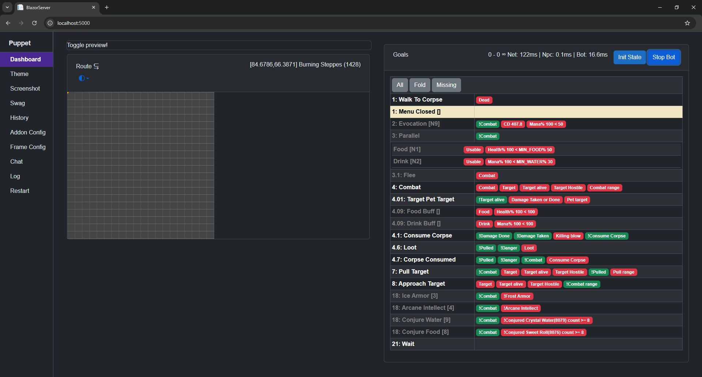
            </a>
        </td>
        <td>
            <a href="./images/flat_light.png" target="_blank">
                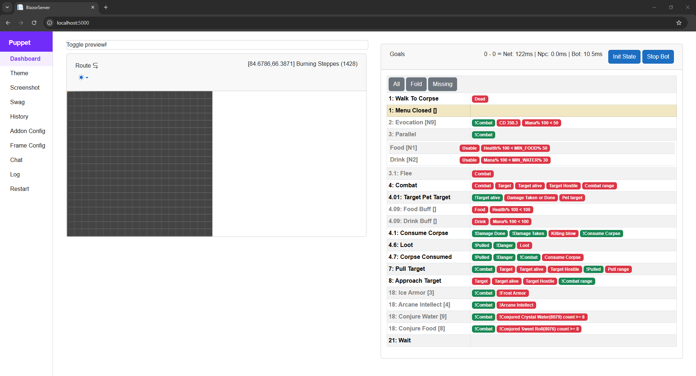
            </a>
        </td>
    </tr>
    <tr>
        <td>
            <a href="./images/dark_leaflet.png" target="_blank">
                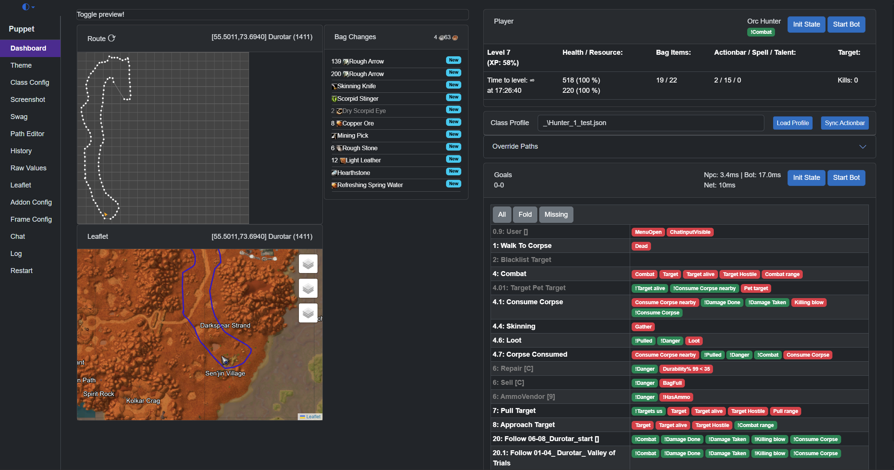
            </a>
        </td>
    </tr>
</table>

[](https://www.youtube.com/watch?v=CIMgbh5LuCc)

<a href="https://mega.nz/file/vf5BhZiJ#yX77HpxremieqGPQSUgZn55bPqJPz6xRLq2n-srt8eY" target="_blank">
   
</a>

<a href="https://mega.nz/file/KDRiCAzI#DamyH3QCha8vm4qfhqVYRb6ffbkhvfyZxWhz9D1OKEc" target="_blank">
   
</a>

# Issues, Ideas & Contributing

Create an issue with the given template.

You are welcome to create pull requests. Some ideas of things that could be improved:

* This readme
* More route and class profiles
* Feel free to ask questions by opening new issues

# Installation

This section guides you through the complete setup process. Here's an overview of what you'll do:

| Step | What You'll Do | Why It's Needed |
| --- | --- | --- |
| 1 | Download repository | Get the application source code |
| 2 | Download MPQ/navmesh files | Provides world geometry for pathfinding |
| 3 | Configure system requirements | Ensure WoW displays correctly for pixel reading |
| 4 | Build the application | Compile the source code into runnable programs |
| 5 | Configure the addon | Set up communication between WoW and the application |
| 6 | Start the dashboard | Launch the web interface for control and monitoring |
| 7 | (Optional) HeadlessServer | Run without UI for lower resource usage |
| 8-11 | Configure WoW client | Set up keybindings and interface options |
| 12 | Create class profile | Define your combat rotation and behavior |

**Tip**: Steps 1-6 are one-time setup. After initial setup, you'll only need to start WoW, run the application, and load a profile.

## Download this Repository

Put the contents of the repo into a folder, e.g., `C:\WowClassicGrindBot`. I am going to refer to this folder from now on, so just substitute your folder path.

## Using V1 Local/Remote Pathing

- Download the MPQ route files.
- These files are required to start the application!

**Vanilla:**
[**common-2.MPQ**](https://mega.nz/file/vXQCBCha#m7COhB9HQd86a5iNAT0-fMLsc-BtoTRO1eIBJNrdTH8) (1.7Gb)

**TBC:**
[**expansion.MPQ**](https://mega.nz/file/Of4i2YQS#egDGj-SXi9RigG-_8kPITihFsLom2L1IFF-ltnB3wmU) (1.8Gb)

**WOTLK:**
[**lichking.MPQ**](https://mega.nz/file/vDYWSTrK#fvaiuHpd-FTVsQT4ghGLK6QJLZyA87c1rlBEeu1_Btk) (2.5Gb)

Copy these files under the **\Json\MPQ** folder (e.g., `C:\WowClassicGrindBot\Json\MPQ`)

Technical details about **V1:**
- Precompiled x86 and x64 [Stormlib](https://github.com/ladislav-zezula/StormLib)
- Source code accessible, written in **C#**
- Uses `*.mpq` files as source
- Extracts the geometry on demand during runtime
- Loads those `*.adt` files which are in use. Lower memory usage compared to V3
- After calculating a path successfully, caches it under `Json\PathInfo\_CONTINENT_NAME_\`
- Easy to visualize path steps and development iteratively

## Optional - Using V3 Remote Pathing

Since [PR 585](https://github.com/Xian55/WowClassicGrindBot/issues/585) using a different branch!

- Download the navmesh files.

[**Vanilla + TBC**](https://mega.nz/file/7HgkHIyA#c_gzUeTadecWY0JDY3KT39ktfPGLs2vzt_90bMvhszk)

[**Vanilla + TBC + Wrath**](https://mega.nz/file/zWQ2XIKI#9EKWOPyyTMfY1LACkcP_wioZ0poVIuaGh2xcRh4V9dw)

[**Vanilla + TBC + Wrath + Cataclysm** - work in progress](https://mega.nz/file/7Og32TDA#5HpxZ8Sh1XvDNCmWbI8H-cOFEJzDmh97Z6FGrO2p3X4)

1. Extract the `mmaps` and copy anywhere you want, like `C:\mmaps`
1. Get the [multi-version-guess-z-coord branch](https://github.com/Xian55/AmeisenNavigation/tree/feature/multi-version-guess-z-coord)
1. Open the solution file.
1. Unload **AmeisenNavigation.Exporter** project(right click -> unload project)
1. 
1. Select **AmeisenNavigation.Server** Press rebuild.
1. Navigate to the `AmeisenNavigation.Server` build(ex. `AmeisenNavigation.Server\build\x64\Release`) location and find `config.cfg`
1. Edit the last line of the file to look like `sMmapsPath=C:\mmaps`
1. Start `AmeisenNavigation.Server.exe`

Technical details about **V3:**
- Uses another project called [AmeisenNavigation](https://github.com/Xian55/AmeisenNavigation/tree/feature/multi-version-guess-z-coord)
- Under the hood uses [Recast and Detour](https://github.com/recastnavigation/recastnavigation)
- Source code is written in **C++**
- Uses `*.mmap` files as source
- Loads the whole continent navmesh data into memory. Higher base memory usage, at least around *~600mb*
- It's super fast path calculations
- Not always suitable for player movement.
- Requires a considerable amount of time to tweak the navmesh config, then bake it

## System / Video Requirements

Tested resolutions with either full screen or windowed:
* 1024 x 768
* 1920 x 1080
* 3440 x 1440
* 3840 x 2160

For Nvidia users, under Nvidia Control panel settings
* Make sure the `Image Sharpening` under the `Manage 3D Settings`-> Global settings or Program Settings(for WoW) is set to `Sharpening Off, Scaling disabled`!

Known issues with other applications:
* `f.lux` can affect final image color on the screen thus prevents NpcNameFinder to work properly.

## Screen Capture Methods

The bot supports two screen capture backends:

| Feature | DXGI | WGC |
|---------|------|-----|
| **Minimum Windows** | Windows 8+ | Windows 10 2004 (build 19041+) |
| **Background capture** | No — game window must be uncovered | Yes — works behind other windows |
| **Borderless capture** | N/A | Yes (build 20348+, no yellow border) |
| **Default** | Yes | No (opt-in via `--reader WGC`) |
| **GPU compute support** | Yes | Yes |

**DXGI** is the default and most compatible.

Use **WGC** if you want to capture the game window while it's behind other windows (requires Win10 2004+).

If **WGC** is requested but unsupported, the application automatically falls back to **DXGI**.

## In-game Requirements

Required game client settings. Press `ESC` -> `System`
  * System > Graphics > Anti-Aliasing: `None`
  * System > Graphics > Vertical Sync: `Disabled`
  * System > Advanced > Contrast: `50`
  * System > Advanced > Brightness: `50`
  * System > Advanced > Gamma from: `1.0`
  * System > Render Scale: `100%`
  * Disable Glow effect - type in the chat `/console ffxGlow 0`
  * To keep/save this settings make sure to properly shutdown the game.

## Optional - Replace Default Game Font

Highly recommended to replace the default in-game font with a much **Bolder** one with [this guide](https://classic.wowhead.com/guides/changing-wow-text-font)

Should be only concerned about `Friz Quadrata: the "Everything Else" Font` which is the `FRIZQT__.ttf` named file.

Example - [Robot-Medium](https://fonts.google.com/specimen/Roboto?thickness=5) - Shows big improvement to the `NpcNameFinder` component which is responsible to find - friendly, enemy, corpse - names above NPCs head.

## Optional - Enable Minimum Character Name Size

In the modern client under ESC > Options > Accessibility > General > **Minimum Character Name Size = 6**

This feature sets a minimum size of the character/npc names above their head.

However it has one downside, there's distance based alpha blending. It could cause issues with Corpse names.

More info [506](https://github.com/Xian55/WowClassicGrindBot/pull/506)

## Build Requirements

* Windows 10 and above
* [.NET 10.0 SDK](https://dotnet.microsoft.com/download/dotnet/10.0)
* `AnyCPU`, `x86` and `x64` build supported.

## Build the Solution

One of the following IDE or command line
* [Visual Studio 2026](https://visualstudio.microsoft.com/downloads/)
* [Visual Studio Code](https://code.visualstudio.com/)
* [Powershell](https://learn.microsoft.com/en-us/powershell/scripting/install/installing-powershell-on-windows?view=powershell-7.5)

e.g. Build from Powershell
```ps
cd C:\WowClassicGrindBot
dotnet build -c Release
```

or look at the `BlazorServer\build.bat`, or look at the `HeadlessServer\build.bat` files.

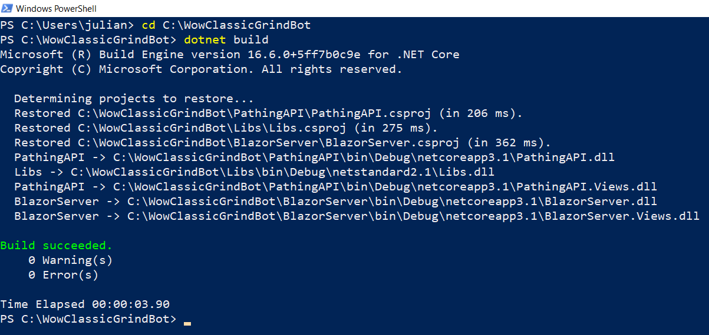

# Configuration

## BlazorServer Configuration Process

The app reads the game state using small blocks of color shown at the top of the screen by an Addon. This needs to be configured.

1. Look at `C:\WowClassicGrindBot\BlazorServer` and run `run.bat`.

1. The **WoW client** must be already running, and make sure to logged with your character.

1. Execute the `C:\WowClassicGrindBot\BlazorServer\run.bat`. This will start the bot and a browser. 

1. If you get `"Unable to find the Wow process is it running ?"` in the console window then it can't find game executable.

1. When running the BlazorServer for the first time you will have to follow a setup process:
    * Start the game and login with a character
    * Navigate to `2. Addon Configuration`
    * Fill the `Author` input form
    * Fill the `Title` input form
    * Then press `Save` button -> Log should see `AddonConfigurator.Install successful`
    * Should see a loading screen
    * At the top left corner of the game window should see flashing pixels / cells
    * Navigate to `5. Frame Configuration` [Guidance for good DataFrame](../../wiki/Guidance-for-good-DataFrame)
    * Click on `Auto` -> `Start` [Validate FrameConfiguration](../../wiki/Validating-FrameConfiguration)

1. Addon Control panel `Status` is `Update Available`
    * Press `Save` button
    * Should see a loading screen
    * Restart the BlazorServer
    * Complete `5. Frame Configuration` steps again
    * Click on `Auto` -> `Start` [Validate FrameConfiguration](../../wiki/Validating-FrameConfiguration)

### Command-line Configuration Overrides

`run.bat` forwards all arguments to `dotnet run`, so any setting from `BlazorServer/appsettings.json` can be overridden using `--Section:Property=Value` syntax.

**Example:**

```
run.bat --Reader:Type=WGC --Pathing:Mode=Local --Reader:UseGpu=true
```

| Section | Property | Type | Default | Valid Values | Description |
|---|---|---|---|---|---|
| `Process` | `Id` | int | `-1` | Any process ID | WoW process ID. `-1` for auto-detect |
| `Reader` | `Type` | string | `DXGI` | `DXGI`, `WGC` | Screen reader type. `WGC` = Windows Graphics Capture (supports background window) |
| `Reader` | `UseGpu` | bool | `false` | `true`, `false` | Use GPU acceleration for screen reading |
| `Pathing` | `Mode` | string | `RemoteV3` | `Local`, `RemoteV1`, `RemoteV3` | Pathfinding mode |
| `Pathing` | `hostv1` | string | `localhost` | hostname/IP | RemoteV1 pathing server host |
| `Pathing` | `portv1` | int | `5001` | port number | RemoteV1 pathing server port |
| `Pathing` | `hostv3` | string | `127.0.0.1` | hostname/IP | RemoteV3 pathing server host |
| `Pathing` | `portv3` | int | `47111` | port number | RemoteV3 pathing server port |
| `Diagnostics` | `Enabled` | bool | `false` | `true`, `false` | Enable diagnostic mode |
| `Overlay` | `Enabled` | bool | `false` | `true`, `false` | Enable NPC overlay |
| `Overlay` | `ShowTargeting` | bool | `false` | `true`, `false` | Show targeting overlay |
| `Overlay` | `ShowSkinning` | bool | `false` | `true`, `false` | Show skinning overlay |
| `Overlay` | `ShowTargetVsAdd` | bool | `false` | `true`, `false` | Show target vs add overlay |

These properties can also be edited directly in `BlazorServer/appsettings.json`.

## BlazorServer Dashboard

## Optional - Running HeadlessServer

Similar to BlazorServer project, except without Frontend. Should consume less system resources in general.

While the bot is running there's no way to adjust / tweak the values. In order to take effect, have to restart.

Firstly be sure to compile the project `HeadlessServer\build.bat`

Everything has to be setup inside the [Class Configuration](#class-configuration) file, in prior.

A successful [Configuration process](#blazorserver-configuration-process) has a result of a following configuration files
* `data_config.json`
* `addon_config.json`
* `frame_config.json`

To see how to first time run the `HeadlessServer` please look at `HeadlessServer\install.bat`.

A few use case when you need to run `install.bat`
* After the first project download
* After git project clone
* After downloading a new version of the project
* After made a change in the source code which result a new Addon Version
* After switched from **FullScreen** to **Windowed mode** thus a `frame_config.json` needed to be recreated

For normal quick startup of `HeadlessServer` please look at the `HeadlessServer\run.bat` or `HeadlessServer\rundev.bat`.

**Required** cli parameter: relative [Class Configuration](#class-configuration) file name under the [/Json/class/](./Json/class) folder.

**Optional** cli parameters:

| cli | Description | Default Value | Possible Values |
| ---- | ---- | ---- | ---- |
| `-m`<br>`-mode` | Pathfinder type | `RemoteV3` | `Local` or `RemoteV1` or `RemoteV3` |
| `-p`<br>`-pid` | World of Warcraft process id | `-1` | open up task manager to find PID |
| `-r`<br>`-reader` | Addon data screen reader backend | `DXGI` | `DXGI` or `WGC`. See [Screen Capture Methods](#screen-capture-methods) |
| `hostv1` | Navigation Remote V1 host | `localhost` | - |
| `portv1` | Navigation Remote V1 port | `5001` | - |
| `hostv3` | Navigation Remote V3 host | `127.0.0.1` | - |
| `portv3` | Navigation Remote V3 port | `47111` | - |
| `-n`<br>`-viz` | While Remote V1 is available, show Path Visualization<br>Can display Remote V3 Paths as well. | `false` | - |
| `-d`<br>`-diag` | Diagnostics, when set, takes screen captures under `Json\cap\*.jpg` | - | - |
| `-o`<br>`-overlay` | Show NpcNameFinder Overlay | `false` | - |
| `-t`<br>`-otargeting` | While overlay enabled, show Targeting points | `false` | - |
| `-s`<br>`-oskinning` | While overlay enabled, show Skinning points | `false` | - |
| `-v`<br>`-otargetvsadd` | While overlay enabled, show Target vs Add points | `false` | - |
| `-g`<br>`--gpu` | Use GPU compute shader for NPC name finding | `true` | `true` or `false` |
| `--loadonly` | Loads the given class profile then exits | `false` | - |

e.g. run from Powershell without any optional parameter
```ps
cd C:\WowClassicGrindBot\HeadlessServer
.\run.bat Hunter_1.json
```

e.g. run from Powershell optional parameters, using `DXGI` reader and forced `Local` pathfinder.
```ps
cd C:\WowClassicGrindBot\HeadlessServer
.\run.bat Hunter_1.json -m Local
```

e.g. run from Powershell optional parameters, only loads the profile then exits a good indicator that your profile can be loaded
```ps
cd C:\WowClassicGrindBot\HeadlessServer
.\run.bat Hunter_1.json -m Local --loadonly
```

## WoW Client - Interface Options

Need to make sure that certain interface options are set.

The most important are `Click-to-Move` and `Do Not Flash Screen at Low Health`.

### Auto-Configured Settings

The addon automatically configures the following CVars when it loads. You do not need to set these manually:

| Category | Setting | Value | Purpose |
| ---- | ---- | ---- | ---- |
| Gameplay | Auto Interact | On | Automatic interaction |
| Gameplay | Auto Loot | On | Automatic looting |
| Gameplay | NPC Names | On | Required for NPC name detection |
| Camera | Camera Following Style | Always | Smooth camera tracking |
| Camera | Click-to-Move Camera Style | Always | Consistent camera behavior |
| Camera | Auto-Follow Speed | Max | Fast camera response |
| Graphics | Anti-Aliasing | None | Required for pixel reading |
| Graphics | Vertical Sync | Off | Reduces input lag |
| Graphics | Render Scale | 100% | Accurate pixel colors |
| Graphics | Glow Effect | Off | Clean pixel reading |
| Display | Contrast | 50 | Calibrated for pixel reading |
| Display | Brightness | 50 | Calibrated for pixel reading |
| Display | Gamma | 1.0 | Calibrated for pixel reading |

### Manual Settings

The following settings must still be configured manually from the main menu (ESC) -> Interface Options:

| Interface Option | Value | Why |
| ---- | ---- | ---- |
| Controls - Enable Interact Key | **true** | Required for INTERACTTARGET binding to work |
| Controls - Interact on Left click | &#9744; | Prevents accidental interactions while navigating |
| Combat - Do Not Flash Screen at Low Health | &#9745; | Screen flashing corrupts pixel color reading |
| Combat - Auto Self Cast | &#9745; | Buffs/heals automatically target self when no target |
| Names - Enemy Units (V) | &#9744; | Health bars can obscure NPC names, interfering with detection |
| Accessibility - Cursor Size | **32x32** | Larger cursor is easier for the bot to detect and classify |
| Accessibility - Minimum Character Name Size | **6** | Ensures NPC names are large enough to be detected reliably |

## WoW Client - Key Bindings

**Important Change**: The addon now automatically reads your in-game keybindings. You no longer need to manually configure most keybindings in the class profile - the addon will detect and use whatever keys you have bound in WoW.

### Automatic Keybinding Detection

When the addon loads, it reads your current keybindings from the game and sends them to the application. This means:

- You can keep using your existing keybinding setup
- Modifier keys (Shift, Ctrl, Alt) are fully supported
- The application will use whatever keys you have bound for each action

### Auto-Setup of Essential Bindings

On first run (or if essential bindings are missing), the addon will automatically set up:

**Targeting and Interaction:**
| Binding | Default Key | Why Needed |
| ---- | ---- | ---- |
| Target Nearest Enemy | `Tab` | Primary method for finding and engaging enemies |
| Target Last Target | `G` | Re-targets last killed mob for looting |
| Assist Target | `F` | Targets your target's target (useful for assist mode) |
| Target Pet | `NumpadMultiply` | Required for pet class healing/buffing pet |
| Pet Attack | `NumpadMinus` | Commands pet to attack current target |
| Interact With Target | `Alt-Home` | Opens loot windows, talks to NPCs, interacts with objects |
| Interact With Mouseover | `Alt-End` | Used by NPC name targeting for mouse-based interaction |
| Target Focus | `Alt-PageUp` | Used in Assist Focus mode to target the leader (TBC+) |
| Target Party Member 1 | `Alt-PageUp` | Vanilla alternative (no focus system) |
| Follow Target | `Alt-PageDown` | Used in Assist Focus mode to follow the leader |

**Custom Actions (Secure Buttons):**
| Binding | Default Key | Why Needed |
| ---- | ---- | ---- |
| Stop Attack | `Alt-Delete` | Stops combat when fleeing or to prevent accidental pulls |
| Clear Target | `Alt-Insert` | Clears target to allow fresh targeting |
| Config Toggle | `Shift-PageUp` | Toggles addon config mode for frame setup |
| Flush State | `Shift-PageDown` | Resets addon data queues when state gets out of sync |

**Note**: The command prefix (e.g., `dc`) is derived from your addon title configured during setup. If your addon is named "daq", commands would be `/daq`, `/daqflush`, etc.

### Movement Keys

Movement keys are still configured in the [Class Configuration](#class-configuration) file since they may vary per profile:

| In-Game | ClassConfiguration Name | Default |
| ---- | ---- | ---- |
| Move Forward | ForwardKey | `UpArrow` |
| Move Backward | BackwardKey | `DownArrow` |
| Turn Left | TurnLeftKey | `LeftArrow` |
| Turn Right | TurnRightKey | `RightArrow` |

To use `WASD` movement, add to your class profile (or see `Json\class\Warrior_1_MovementKeys.json`):
```json
"ForwardKey": 87,   // W
"BackwardKey": 83,  // S
"TurnLeftKey": 65,  // A
"TurnRightKey": 68, // D
```

### Manual Binding Setup (Optional)

If you prefer to set up bindings manually or the auto-setup didn't work, you can use these slash commands:

| Command | Description |
| ---- | ---- |
| `/<prefix>bindings` | Sets up default action bar keybindings (F1-F12, Numpad) |
| `/<prefix>actions` | Creates and binds the custom secure action buttons |

**Note**: Replace `<prefix>` with your addon's command prefix (e.g., `/dcbindings` if your prefix is `dc`). The prefix is derived from the addon title you configured during setup.

These commands save bindings to your current binding set (account-wide or character-specific).

## Actionbar Key Bindings

The addon reads your actual action bar keybindings from the game. You can use any keys you prefer, including modifier combinations.

### Supported Action Bars

| Actionbar | Slot Range | Default Keys | WoW Binding Names |
| --- | --- | --- | --- |
| Main | 1-12 | `1,2,3..9,0,-,=` | ACTIONBUTTON1-12 |
| Bottom Right | 49-60 | `Numpad1-9, Numpad0` | MULTIACTIONBAR2BUTTON1-12 |
| Bottom Left | 61-72 | `F1-F12` | MULTIACTIONBAR1BUTTON1-12 |

### Using Your Own Keybindings

The application will automatically detect whatever keys you have bound to your action bars. For example:
- If you bound `Shift-1` to action slot 1, the app will press `Shift-1`
- If you bound `Q` to Bottom Left slot 61, the app will press `Q`

### Quick Setup with Default Bindings

If you want to use the recommended default bindings, run `/dcbindings` in-game. This will set up:
- Bottom Right bar (slots 49-60): `Numpad1` through `Numpad0`
- Bottom Left bar (slots 61-72): `F1` through `F12`

The Main action bar (slots 1-12) keybindings are left unchanged since most players already have these configured.

### Action Bar Validation

The frontend now includes an **Action Bar Validation** feature that checks if your spells are placed in the correct slots. If there are mismatches:
- A warning badge will appear showing the number of issues
- You can click to see which spells need to be moved
- Use the **Sync Actionbar** button to automatically place spells in the correct slots

### Known Limitation: Main Action Bar Slots 11 and 12

The Main Action Bar slots 11 and 12 use the `-` and `=` keys respectively. These keys are mapped to `OemMinus` and `OemPlus` ConsoleKey values, which are **keyboard layout dependent**.

**Currently, slots 11 and 12 only work correctly with US English keyboard layout.**

On non-US keyboard layouts, the physical key that produces `-` or `=` may have a different virtual key code. As a workaround:
- Avoid using slots 11 and 12 on the Main Action Bar
- Use the Bottom Right (Numpad) or Bottom Left (F1-F12) action bars instead, which work on all keyboard layouts

<a href="./images/keybindings.png" target="_blank">
   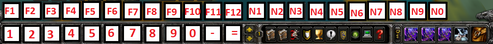
</a>

## Custom Actions (BindPad)

The BindPad addon is bundled in `Addons/BindPad/` and is required for TBC Classic 2.5.5+ compatibility. Blizzard patched `SecureActionButtonTemplate` macrotext in recent clients, breaking dynamically created secure buttons. BindPad's button works due to its initialization approach.

### How It Works

The addon uses BindPad's secure macro button (`BindPadMacro`) internally to execute custom actions like StopAttack and ClearTarget. These are bound to keys automatically on first run.

| Action | Default Key | What It Does |
| ---- | ---- | ---- |
| Stop Attack | `Alt-Delete` | Stops attacking and cancels casting |
| Clear Target | `Alt-Insert` | Clears current target |
| Config Toggle | `Shift-PageUp` | Toggles addon config mode (`/<prefix>`) |
| Flush State | `Shift-PageDown` | Refreshes addon state (`/<prefix>flush`) |

### Manual Setup

If the bindings were not set up automatically (e.g., you were in combat), run:
```
/<prefix>actions
```

Replace `<prefix>` with your addon's command prefix (e.g., `/dcactions` if your prefix is `dc`).

This creates the secure buttons and binds them to the default keys. The bindings are saved to your current binding set (account-wide or character-specific).

### BindPad Setup

BindPad is bundled in `Addons/BindPad/` and must be installed:
1. Copy the `BindPad` folder to your WoW `Interface/AddOns/` directory
2. Enable the BindPad addon in your addon list
3. The DataToColor addon will automatically use BindPad's secure button for custom actions

### Why Alt-Modified Keys?

The custom actions use Alt-modified keys (`Alt-Delete`, `Alt-Insert`, etc.) because:
- They work reliably with the PostMessage input method (background key sending)
- They are unlikely to conflict with your existing keybindings
- They avoid accidentally triggering actions when typing in chat

# Class Configuration

If one of the Properties is not explicitly mentioned during the configuration or in the examples, you can assume it uses the default value!

Each class has a configuration file in [/Json/class/](./Json/class) e.g. the config for a `Warrior` it is in file [Warrior_1.json](./Json/class/Warrior_1.json).

The configuration file determines what spells the character casts, when pulling and in combat, where to vendor and repair and what buffs to consider.

Take a look at the class files in [/Json/class/](./Json/class) for examples of what you can do.

Your class file probably exists and just needs to be edited to set the pathing file name.

### Understanding Class Configuration

The class configuration controls all aspects of bot behavior. Here's why each section matters:

| Section | Purpose |
| --- | --- |
| **Loot/Skin/Herb/Mine** | Controls what the bot does after killing mobs. Enable based on your character's professions. |
| **UseMount** | Speeds up travel between grind spots. Disable if you don't have a mount or in areas where mounting is problematic. |
| **PathFilename** | Defines where the bot walks. Without a path, the bot won't know where to go. |
| **NPCMaxLevels_Above/Below** | Prevents attacking mobs that are too high (dangerous) or too low (no XP). |
| **Blacklist** | Avoids specific mobs that cause problems (e.g., quest mobs, mobs with annoying abilities). |
| **Pull/Combat/Flee** | The core combat rotation. Pull defines how to start fights, Combat is the main rotation, Flee is emergency escape. |
| **NPC** | Defines vendor/repair routes. Essential for extended grinding sessions. |
| **Mail/MailConfig** | Automatically sends excess items and gold to another character. Useful for keeping inventory clear during long sessions. |

| Property Name | Description | Optional | Default value |
| --- | --- | --- | --- |
| `"Log"` | Should logging enabled for [`KeyAction(s)`](#keyaction). Requires restart. | true | `true` |
| `"LogBagChanges"` | Should bag changes logs enabled for. | true | `true` |
| `"Loot"` | Should loot the mob | true | `true` |
| `"Skin"` | Should skin the mob | true | `false` |
| `"Herb"` | Should herb the mob | true | `false` |
| `"Mine"` | Should mine the mob | true | `false` |
| `"Salvage"` | Should salvage the mob | true | `false` |
| `"UseMount"` | Should use mount when its possible | true | `false` |
| `"AllowPvP"` | Should engage combat with the opposite faction | true | `false` |
| `"TargetNeutral"` | Should detect neutral (yellow) nameplates in addition to hostile (red). Enable for starting zones (levels 1-5) where mobs are neutral. | true | `false` |
| `"AutoPetAttack"` | Should the pet start attacking as soon as possible | true | `true` |
| `"CrossZoneSearch"` | Allow NPC search across zone boundaries for cross-zone routes | true | `false` |
| `"KeyboardOnly"` | Use keyboard to interact only. See [KeyboardOnly](#keyboardonly) | false | `true` |
| --- | --- | --- | --- |
| `"PathFilename"` | [Path](#path) to use while alive | **false** or [Multiple Paths with Requirements](#multiple-paths-with-requirements) | `""` |
| `"PathThereAndBack"` | While using the path, [should go start to and reverse](#there-and-back) | true | `true` |
| `"PathReduceSteps"` | Reduce the number of path points | true | `false` |
| `"SideActivityRequirements"` | List of [Requirements](#requirement) to limit when the player should search for target<br/>Great for enforcing how closely should follow the path. | true | `true` |
| --- | --- | --- | --- |
| `"Paths"` | Array of [PathSettings](#pathsettings).<br>Either define this array or use the above properties | true | `[]` |
| `"Mode"` | What kind of [behaviour](#modes) should the bot operate | true | `Mode.Grind` |
| `"NPCMaxLevels_Above"` | Maximum allowed level above difference to the player | true | `1` |
| `"NPCMaxLevels_Below"` | Maximum allowed level below difference to the player | true | `7` |
| `"CheckTargetGivesExp"` | Only engage the target if it yields experience | true | `false` |
| `"Blacklist"` | List of names or sub names which must be avoid engaging | true | `[""]` |
| `"TargetMask"` | [`TargetMask`](#targetmask) — [UnitClassification](https://wowpedia.fandom.com/wiki/API_UnitClassification) types that allowed to engage with. | true | `"Normal, Trivial, Rare"` |
| `"NpcSchoolImmunity"` | List of NpcIDs which have one or more [SchoolMask](#npcschoolimmunity) immunities | true | `""` |
| `"IntVariables"` | List of user defined `integer` or `integer[]` variables. See [`IntVariables`](#intvariables) | true | `[]` |
| `"StringVariables"` | List of user defined `string` variables. See [`StringVariables`](#stringvariables) | true | `[]` |
| --- | --- | --- | --- |
| `"Pull"` | [KeyActions](#keyactions) to execute upon [Pull Goal](#pull-goal) | true | `{}` |
| `"Flee"` | [KeyActions](#keyactions) to execute upon [Flee Goal](#flee-goal). | true | `{}` |
| `"Combat"` | [KeyActions](#keyactions) to execute upon [Combat Goal](#combat-goal) | **false** | `{}` |
| `"AssistFocus"` | [KeyActions](#keyactions) to execute upon [Assist Focus Goal](#assist-focus-goal) | **false** | `{}` |
| `"Adhoc"` | [KeyActions](#keyactions) to execute upon [Adhoc Goals](#adhoc-goals) | true | `{}` |
| `"Parallel"` | [KeyActions](#keyactions) to execute upon [Parallel Goal](#parallel-goals) | true | `{}` |
| `"NPC"` | [KeyActions](#keyactions) to execute upon [NPC Goal](#npc-goals) | true | `{}` |
| `"Wait"` | [KeyActions](#keyactions) to execute upon [Wait Goal](#wait-goals) | true | `{}` |
| --- | --- | --- | --- |
| `"Mail"` | Enable mail functionality | true | `false` |
| `"MailFilename"` | External mail config file path (relative to `Json/mail/`) | true | `""` |
| `"MailConfig"` | Inline mail configuration object. See [Mail Goal](#mail-goal) | true | `{}` |
| --- | --- | --- | --- |
| `"GatherFindKeys"` | List of strings for switching between gathering profiles | true | `string[]` |
| --- | --- | --- | --- |
| BaseActionKeys | Description | Optional | Default value |
| --- | --- | --- | --- |
| `"Jump.Key"` | Key to Jump | true | `"Spacebar"` |
| `"Interact.Key"` | Key to Interact with target. Supports modifiers. | true | `"Alt-Home"` |
| `"InteractMouseOver.Key"` | Key to Interact with mouseover. Supports modifiers. | true | `"Alt-End"` |
| `"TargetLastTarget.Key"` | Key to Target last target | true | `"G"` |
| `"ClearTarget.Key"` | Key to clear current target. Supports modifiers. | true | `"Alt-Insert"` |
| `"StopAttack.Key"` | Key to stop attack. Supports modifiers. | true | `"Alt-Delete"` |
| `"TargetNearestTarget.Key"` | Key to target nearest enemy | true | `"Tab"` |
| `"TargetTargetOfTarget.Key"` | Key to target - target of target | true | `"F"` |
| `"TargetPet.Key"` | Key to target pet | true | `"Multiply"` |
| `"PetAttack.Key"` | Key to send pet to attack | true | `"Subtract"` |
| `"TargetFocus.Key"` | Key to target focus (TBC+) or party member 1 (Vanilla). Supports modifiers. | true | `"Alt-PageUp"` |
| `"FollowTarget.Key"` | Key to follow target. Supports modifiers. | true | `"Alt-PageDown"` |
| `"Mount.Key"` | Key to use mount | true | `"O"` |
| `"StandUp.Key"` | Key to stand up / sit down | true | `"X"` |
| --- | --- | --- | --- |
| `"ForwardKey"` | [ConsoleKey](https://learn.microsoft.com/en-us/dotnet/api/system.consolekey) to be pressed to move forward | true | `"UpArrow"` |
| `"BackwardKey"` | [ConsoleKey](https://learn.microsoft.com/en-us/dotnet/api/system.consolekey) to be pressed to move backward | true | `"DownArrow"` |
| `"TurnLeftKey"` | [ConsoleKey](https://learn.microsoft.com/en-us/dotnet/api/system.consolekey) to be pressed to turn left | true | `"LeftArrow"` |
| `"TurnRightKey"` | [ConsoleKey](https://learn.microsoft.com/en-us/dotnet/api/system.consolekey) to be pressed to turn right | true | `"RightArrow"` |

The following [KeyActions](#keyactions) are `BaseActions`: `Jump`, `Interact`, `InteractMouseOver`, `TargetLastTarget`, `ClearTarget`, `StopAttack`, `TargetNearestTarget`, `TargetTargetOfTarget`, `TargetPet`, `PetAttack`, `TargetFocus`, `FollowTarget`, `Mount`, `StandUp`.

**Note on Modifier Keys**: BaseActions that support modifiers can be specified with `Shift-`, `Ctrl-`, or `Alt-` prefixes. For example:
```json
"Interact": {
    "Key": "Alt-Home"
},
"ClearTarget": {
    "Key": "Alt-Insert"
}
``` 

Which are shared and unified among [Pull Goal](#pull-goal) and [Combat Goal](#combat-goal).

e.g override default [KeyActions](#keyactions) properties in the [Class Configuration](#class-configuration) file
```json
"Mount": {
    "Key": "N0"
},
"Jump": {
    "PressDuration": 200
}
```

### TargetMask

Based of [UnitClassification](https://wowpedia.fandom.com/wiki/API_UnitClassification) API.

| UnitClassification |
| --- |
| Normal |
| Trivial |
| Minus |
| Rare |
| Elite |
| RareElite |
| WorldBoss |

The mentioned values can be combined together like:

e.g.
```json
"TargetMask": "Normal, Trivial, Rare, Elite, RareElite",    // multiple combined
```

Where `Elite` and `RareElite` have been included compared to default.

### NpcSchoolImmunity

| SchoolMask |
| --- |
| None |
| Physical |
| Holy |
| Fire |
| Nature |
| Frost |
| Shadow |
| Arcane |

Defined as KeyValuePair where the key is the NPC Id and the value is the type of `SchoolMask` type is immune against.

The mentioned values can be combined together like:

e.g.
```json
"NpcSchoolImmunity": {
    "1043": "Shadow",                   // single
    "9026": "Fire",
    "1668": "Fire, Shadow, Arcane"      // multiple combined
}
```

### KeyboardOnly

By Default, the bot attempts to use the mouse for the following reasons:
* `Follow Route Goal` Targeting non blacklisted npcs
* `Loot Goal` and `Skinning Goal` while acquiring target

You can disable this behavior by setting [`KeyboardOnly`](#keyboardonly) to `true` in the [Class Configuration](#class-configuration). Which has the following effects:
* `Loot` limited, only capable of looting by selecting last target. So after each killed mob only the **last npc** can be looted.
* GatherCorpse(`Skin`, `Herb`, `Mine`, `Salvage`) unavailable.
* Target selection limited to only `TargetNearestTargetKey`, which significantly reduce how quickly can find the next target.

### IntVariables

Gives the ability to the user to define global integer variables along the whole [Class Configuration](#class-configuration) scope.

Each value can be either a single integer or an **array of integers**. Array values are useful for aura prefixes (`Buff_`, `Debuff_`, `TDebuff_`, `TBuff_`, `FBuff_`) where you want to check if **any** of several icon IDs is active. The variable evaluates to the **maximum remaining time** across all IDs in the array, so `Debuff_POISON > 1` is true when any of the listed poisons is active.

For example look at the Warlock profiles.
```json
"IntVariables": {
    "DOT_MIN_HEALTH%": 35,
    "TDebuff_Frost Fever": 237522,   // iconId https://www.wowhead.com/icons
    "TDebuff_Blood Plague": 237514,  // iconId https://www.wowhead.com/icons
    "FBuff_Rejuvenation": 12345,
    "Buff_Slice and Dice": 99999,
    "Debuff_Poison": 135368,
    "TBuff_Dispel on Target": 16846,
    "Item_Soul_Shard": 6265,
    // ...
    // ...
    "ITEM_ARROW": 2512,
    "MIN_COUNT_ARROW": 200,
    "AMMO_SLOT": 5
}
```

**Array syntax** — group multiple icon IDs under a single variable:
```json
"IntVariables": {
    "Debuff_POISON": [136006, 136007, 136016, 136064, 136067, 136077, 136093, 134437, 132273, 132274, 132105],
    "Debuff_DISEASE": [136127, 136134, 134324, 135914]
}
```
Then use a single requirement instead of chaining many `||` conditions:
```json
"Requirements": ["Debuff_POISON > 1 || Debuff_DISEASE > 1"]
```

### StringVariables

Similar as [IntVariables](#intvariables) just for string values

Note: if the `value` matches any of the [`IntVariables`](#intvariables) key, the `value` will be replaced with the IntVariable value.

When the variable name starts with `$ITEM_NAME` the value will be replaced with the Item English localized, in this example `Rough Arrow`.

When the variable name starts with `$NPC_NAME` the value will be replaced with the NPC English localized name.

```json
"StringVariables": {
    "$ITEM_NAME_ARROW": "ITEM_ARROW",
    "$AMMO_SLOT": "AMMO_SLOT"
}
```

### Path

The path that the player follows during [Follow Route Goal](#follow-route-goal), its a `json` file under [/Json/path/](./Json/path) which contains a list of `x`,`y`,`z` coordinates while looking for mobs.

### PathSettings

| Property Name | Description | Optional | Default value |
| --- | --- | --- | --- |
| `"PathFilename"` | [Path](#path) to use while alive | **false** | `""` |
| `"Id"` | <b>Must be a Unique Integer value</b> to identify PathSettings. | true | `"Auto incremented from zero"` or `"Unless specified by user."` |
| `"PathThereAndBack"` | While using the path, [should go start to and reverse](#there-and-back) | true | `true` |
| `"PathReduceSteps"` | Reduce the number of path points | true | `false` |
| `"SideActivityRequirements"` | List of [Requirements](#requirement) to limit when the player should search for target<br/>Great for enforcing how closely should follow the path. | true | `true` |

### Simple approach

When the below properties are defined in the [Class Configuration](#class-configuration), a new [PathSettings](#pathsettings) instance is created under in `Paths` array as the first element.

```json
"Id": 42,                                                               // Optional - Helps identify the path
"PathFilename": "_pack\\1-20\\Dwarf.Gnome\\1-4_Dun Morogh.json.json",   // the path to walk when alive
"PathThereAndBack": true,                                               // if true walks the path and the walks it backwards.
"PathReduceSteps": true,                                                // uses every other coordinate, halve the coordinate count
"SideActivityRequirements": [ "PathDist_0 < 10" ]                       // Limit when should search for target, note if multiple paths are used _0 has to be changed accordingly
```

I keep the previously mentioned properties for backward compatibility and also if you not interested in changing path during runtime.

Example can be found under [Warrior_1.json](./Json/class/Warrior_1.json).

### Multiple Paths with Requirements

With the latest update it is possible to change between multiple paths during runtime.

In that case properties what mentioned in [Simple approach](#simple-approach) are ignored.

Instead using another structure called [Class Configuration.Paths](#class-configuration) array, which is very similar, however there is an additional [Requirements](#requirement) field. Backed by [PathSettings](#pathsettings) object.

Let's look at the following example
- It is really important to always have one `Path` which doesn't have any condition, serves as fallback.
- 3 paths defined here. 2 with conditions and 1 with fallback(no requirements which means it can always run)
- The definition order matters, the first element has the highest priority, while the last element in the array has the lowest.
- Each path is added as a new [Follow Route Goal](#follow-route-goal) with a custom cost. The base cost is 20, and its auto incremented by `0.1f`. So you can even add your own logic in between the goals.
- Each [Follow Route Goal](#follow-route-goal) component preserves it state from the last execution time.
- It can accept [Requirements](#requirement) as condition.

```json
"Paths": [
{
    "PathFilename": "1-5_Gnome.json",                                 // Only runs when the player is below level 4 
    "PathThereAndBack": false,
    "PathReduceSteps": false,
    "Requirements": [
        "Level < 4"
    ]
},
{
    "PathFilename": "_pack\\1-20\\Dwarf.Gnome\\1-4_Dun Morogh.json",  // Only runs when the player is at least level 4 but below level 5
    "Requirements": [
        "Level < 5"
    ]
},
{
    "PathFilename": "_pack\\1-20\\Dwarf.Gnome\\4-6_Dun Morogh.json",  // Runs when the player is at least level 5
    "PathThereAndBack": false,
    "PathReduceSteps": false
}
],
```

The previously mentioned example can be found under [Hunter_1.json](./Json/class/Hunter_1.json).

#### Time-based Path Cycling

You can cycle between grinding spots on a timer using `SessionMinutes % N` in path requirements. `SessionMinutes` tracks how long the current session has been running, and the modulo `%` operator divides time into repeating intervals.

**Example: Alternate between two paths every 20 minutes (40-minute cycle)**

```json
"PathFilename": [
{
    "PathFilename": "spot_A.json",
    "Requirements": [
        "SessionMinutes % 40 < 20"
    ]
},
{
    "PathFilename": "spot_B.json",
    "Requirements": [
        "SessionMinutes % 40 >= 20"
    ]
}
],
```

For 3+ paths, divide the cycle into ranges. For example, a 60-minute cycle with three 20-minute segments:

- Path A: `"SessionMinutes % 60 < 20"`
- Path B: `"SessionMinutes % 60 >= 20 && SessionMinutes % 60 < 40"`
- Path C: `"SessionMinutes % 60 >= 40"`

### KeyActions

It's a container type for `Sequence` of [KeyAction](#keyaction).

### KeyAction

Each `KeyAction` has its own properties to describe what the action is all about. 

Can specify conditions with [Requirement(s)](#requirement) in order to create a matching action for the situation.

| Property Name | Description | Default value |
| --- | --- | --- |
| `"Name"` | Name of the KeyAction. **Naming convention**: Lowercase names indicate macros (e.g., `"stopattack"`, `"petattack"`), while capitalized names indicate spells (e.g., `"Frostbolt"`, `"Healing Wave"`). This affects how `ActionBarPopulator` and action bar validation handle the entry. | `""` |
| `"Key"` | [ConsoleKey](https://learn.microsoft.com/en-us/dotnet/api/system.consolekey) to press. Supports modifier prefixes: `Shift-`, `Ctrl-`, `Alt-` (e.g., `"Shift-1"`, `"Alt-F1"`) | `""` |
| `"Modifier"` | Modifier key to hold while pressing the key. Values: `"None"`, `"Shift"`, `"Ctrl"`, `"Alt"`. Alternative to using prefix in `Key`. **Note**: Combined modifiers (e.g., `Shift-Alt`) are not supported - only single modifiers. | `"None"` |
| `"Cost"` | [Adhoc Goals](#adhoc-goals) or [NPC Goal](#npc-goals) only, priority | `18` |
| `"PathFilename"` | [NPC Goal](#npc-goals) only, this is a short path to get close to the NPC to avoid walls etc. | `""` |
| `"HasCastBar"` | After key press cast bar is expected?<br>By default sets `BeforeCastStop`=`true` | `false` |
| `"InCombat"` | Should combat matter when attempt to cast?<br>Accepted values:<br>* `"any value for doesn't matter"`<br>* `"true"`<br>* `"false"` | `false` |
| `"Item"` | Like on use Trinket, `Food`, `Drink`.<br>The following spells counts as Item, `Throw`, `Auto Shot`, `Shoot` | `false` |
| `"PressDuration"` | How many minimum milliseconds to hold the key press down | `50` |
| `"Form"` | Shapeshift/Stance form to be in to cast this spell<br>If set, affects `WhenUsable` | `Form.None` |
| `"Cooldown"` | **Note this is not the in-game cooldown!**<br>The time in milliseconds before KeyAction can be used again.<br>This property will be updated when the backend registers the `Key` press. It has no feedback from the game. | `400` |
| `"Charge"` | How many consequent key press should happen before setting Cooldown | `1` |
| `"School"` | Indicate what type of [SchoolMask](#npcschoolimmunity) element the spell will do.  | `None` |
| `"MacroText"` | You can specify a macro text or macro template which can hold variables. make sure the MacroText is no longer then 255 characters. | `""` |
| `"BaseAction"` | Bypasses CastingHandler guard rails (GCD waiting, spell queue checks, cast verification). Use for actions that execute instantly without cast bars or cooldowns. See [BaseActions](#baseactionkeys). | `false` |
| --- | --- | --- |
| `"WhenUsable"` | Mapped to [IsUsableAction](https://wowwiki-archive.fandom.com/wiki/API_IsUsableAction) | `false` |
| `"UseWhenTargetIsCasting"` | Checks for the target casting/channeling.<br>Accepted values:<br>* `null` -> ignore<br>* `false` -> when enemy not casting<br>* `true` -> when enemy casting | `null` |
| `"Requirement"` | Single [Requirement](#requirement) | `false` |
| `"Requirements"` | List of [Requirement](#requirement) | `false` |
| `"Interrupt"` | Single [Requirement](#requirement) | `false` |
| `"Interrupts"` | List of [Requirement](#requirement) | `false` |
| `"CancelOnInterrupt"` | If the [Interrupt](#interrupt-requirement) [Requirement](#requirement) has met, shall **Cancel** current castbar spellcast (sending ESC) | `false` |
| `"ResetOnNewTarget"` | Reset the Cooldown if the target changes | `false` |
| `"Log"` | Related events should appear in the logs | `true` |
| `"UseMount"` | Should use mount ? <br/>Limited to [AdhocNpcGoals](#npc-goals) such as `Repair`, `Sell`, `Vendor` routes. | `false` |
| --- | Before keypress cast, ... | --- |
| `"BeforeCastFaceTarget"` | Attempt to look directly at target.<br>**Note**: it may not work for every scenario. | `false` |
| `"BeforeCastDelay"` | Delay in milliseconds. | `0` |
| `"BeforeCastMaxDelay"` | Max delay in milliseconds.<br>If set then using random delay between [`BeforeCastDelay`..`BeforeCastMaxDelay`] | `0` |
| `"BeforeCastStop"` | Stop moving. | `false` |
| `"BeforeCastDismount"` | Should dismount. [Adhoc Goals](#adhoc-goals) only. | `true` |
| --- | After Successful cast, ... | --- |
| `"AfterCastWaitSwing"` | Wait for next melee swing to land.<br>Blocks **CastingHandler**. | `false` |
| `"AfterCastWaitCastbar"` | Wait for the castbar to finish, `SpellQueueTimeMs` excluded.<br>Blocks **CastingHandler**. | `false` |
| `"AfterCastWaitBuff"` | Wait for Aura=__(player-target debuff/buff)__ count changes.<br>Only works properly, when the Aura **count** changes.<br>Not suitable for refreshing already existing Aura<br>Blocks **CastingHandler**. | `false` |
| `"AfterCastAuraExpected"` | Refreshing Aura=__(player-target debuff/buff)__<br>Just adds an extra(`SpellQueueTimeMs`) Cooldown to the action, so it wont repeat itself.<br>Not blocking  **CastingHandler**. | `false` |
| `"AfterCastWaitBag"` | Wait for any inventory, bag change.<br>Blocks **CastingHandler**. | `false` |
| `"AfterCastWaitCombat"` | Wait for player entering combat.<br>Blocks **CastingHandler**. | `false` |
| `"AfterCastWaitMeleeRange"` | Wait for interrupted either:<br>* target enters melee range<br>* target starts casting<br>* player receives damage<br>Blocks **CastingHandler**. | `false` |
| `"AfterCastStepBack"` | Start backpedaling for milliseconds.<br>If value set to `-1` attempts to use the whole remaining GCD duration.<br>Blocks **CastingHandler**. | `0` |
| `"AfterCastWaitGCD"` | the Global cooldown fully expire.<br>Blocks **CastingHandler**. | `false` |
| `"AfterCastDelay"` | delay in milliseconds.<br>Blocks **CastingHandler**. | `0` |
| `"AfterCastMaxDelay"` | delay in milliseconds.<br>If set then using random delay between [`AfterCastDelay`..`AfterCastMaxDelay`]<br>Blocks **CastingHandler**. | `0` |
| --- | --- | --- |

Some of these properties are optional and not required to be specified.

However you can create complex conditions and branches to suit the situation.

Important, the `AfterCast` prefixed conditions are ordered as shown in the table above.

#### Understanding KeyAction Properties

**Why use these properties?**

| Property Group | Purpose |
| --- | --- |
| `HasCastBar` | Tells the bot to wait for the cast to complete before taking the next action. Without this, the bot might interrupt your cast by pressing another key. |
| `WhenUsable` | Only attempts to cast when the game reports the ability is usable (enough mana/rage/energy, not on cooldown). Prevents wasting key presses. |
| `Cooldown` | Prevents the bot from spamming the same ability. This is the bot's internal cooldown, not the game's. Set to match GCD (~400ms) for most abilities. |
| `Form` | For Druids/Warriors - ensures you're in the correct shapeshift/stance before casting. Prevents "Can only use in Cat Form" errors. |
| `School` | Used with [`NpcSchoolImmunity`](#npcschoolimmunity) to skip spells against immune targets (e.g., don't cast Fire spells on fire-immune mobs). |
| `BaseAction` | Marks the action as a basic system action (jump, interact, target, move) that should execute immediately. Bypasses GCD waiting, spell queue checks, and cast verification — the bot won't wait to confirm success. Use for non-spell key presses that are expected to work 99.99% of the time. |
| `BeforeCastStop` | Stops movement before casting. Essential for spells with cast bars that can't be cast while moving. |
| `BeforeCastFaceTarget` | Turns to face the target. Useful for casters who might be kiting and need to turn around to cast. |
| `AfterCastWaitSwing` | For abilities that reset swing timer (e.g., Heroic Strike). Waits for the swing to land before continuing. |
| `AfterCastWaitBuff` | Waits until a buff/debuff appears. Useful for DoTs - ensures the DoT landed before moving to next ability. |
| `AfterCastStepBack` | Creates distance after casting. Useful for kiting - cast, step back, repeat. |
| [`Requirement(s)`](#requirement) | Conditions that must be true to use this ability. Core of the combat rotation logic. |
| [`Interrupt(s)`](#interrupt-requirement) | Conditions that will interrupt a channeled spell or cancel casting. Useful for react to incoming damage. |

e.g. - bare minimum for a spell which has castbar.
```json
{
    "Name": "Frostbolt",
    "Key": "1",
    "HasCastBar": true,   //<-- Must be indicated the spell has a castbar
}
```

e.g. - bare minimum for a spell which is instant (no castbar)
```json
{
    "Name": "Earth Shock",
    "Key": "6"
}
```

e.g. - using modifier keys (two equivalent ways)
```json
// Option 1: Modifier prefix in Key
{
    "Name": "Corruption",
    "Key": "Shift-1"
}

// Option 2: Explicit Modifier property
{
    "Name": "Corruption",
    "Key": "D1",
    "Modifier": "Shift"
}
```

e.g. for Rogue ability
```json
{
    "Name": "Slice and Dice",
    "Key": "3",
    "Requirements": [
        "!Slice and Dice",
        "Combo Point > 1"
    ]
}
```

There are a few specially named [KeyAction](#keyaction) such as `Food` and `Drink` which is reserved for eating and drinking.

They already have some pre baked [Requirement(s)](#requirement) conditions in order to avoid mistype the definition. 

The bare minimum for `Food` and `Drink` is looks something like this.
```json
{
    "Name": "Food",
    "Key": "-",
    "Requirement": "Health% < 50"
},
{
    "Name": "Drink",
    "Key": "=",
    "Requirement": "Mana% < 50"
}
```

When any of these [KeyAction(s)](#keyaction) are detected, by default, it going to be awaited with a predefined [Wait Goal](#wait-goals) logic.

Should see something like this, you can override any of the following values.

```json
"Wait": {
    "AutoGenerateWaitForFoodAndDrink": true,    // should generate 'Eating' and 'Drinking' KeyActions
    "FoodDrinkCost": 5,                         // can override the Cost of awaiting Eating and Drinking
    "Sequence": [
    {
        "Name": "Eating",
        "Cost": 5,                              // FoodDrinkCost
        "Requirement": "Food && Health% < 99"
    },
    {
        "Name": "Drinking",
        "Cost": 5,                              // FoodDrinkCost
        "Requirement": "Drink && Mana% < 99"
    },
    ]
},
```
---

### Casting Handler

**CastingHandler** is a component responsible for handling player spell casting, 
let it be using an item from the inventory, casting an instant spell or casting a spell which has castbar.

From Addon version **1.6.0** it has been significantly changed to the point where it no longer blocks the execution until the castbar fully finishes, but rather gives back the control to the parent Goal such as [Adhoc Goals](#adhoc-goals) or [Pull Goal](#pull-goal) or [Combat Goal](#combat-goal) to give more time to find the best suitable action for the given moment.

As a result in order to execute the [Pull Goal](#pull-goal) sequence in respect, have to combine its [KeyAction(s)](#keyaction) with `AfterCast` prefixed conditions.

---

## Mail Goal

Automatically mail items and gold to another character when visiting a mailbox.

### Quick Setup

1. Enable mail in your class profile:
```json
{
  "Mail": true,
  "MailConfig": {
    "RecipientName": "YourAltCharacter"
  }
}
```

2. The bot will mail items after vendoring/repairing when:
   - Items meet the quality threshold (default: Green/Uncommon)
   - Player has excess gold above minimum threshold
   - Player is at a mailbox

### Configuration Options

| Property | Type | Default | Description |
|----------|------|---------|-------------|
| `Mail` | bool | `false` | Enable/disable mail for this profile |
| `MailFilename` | string | `""` | External mail config file (relative to `Json/mail/`) |
| `MailConfig.RecipientName` | string | `""` | Character name to send mail to |
| `MailConfig.MinimumGoldToKeep` | int | `10000` | Minimum gold to keep (in copper, 10000 = 1g) |
| `MailConfig.MinimumItemQuality` | int | `2` | Minimum item quality (0=Grey, 1=White, 2=Green, 3=Blue, 4=Epic) |
| `MailConfig.SendGold` | bool | `true` | Whether to send excess gold |
| `MailConfig.SendItems` | bool | `true` | Whether to send items |
| `MailConfig.ExcludedItemIds` | int[] | `[]` | Item IDs to never mail |

### Recipient Priority

The recipient is determined in this order:
1. **UI Setting** (localStorage) - Set via Frontend Mail page
2. **Environment Variable** - `MAIL_RECIPIENT=CharacterName`
3. **JSON Config** - `MailConfig.RecipientName`

### Special Recipient Keywords

Instead of a character name, you can use special keywords:

| Keyword | Behavior |
|---------|----------|
| `UseRandomFriendList` | Randomly selects a character from your friend list (online or offline) |

**Example:**
```json
{
  "Mail": true,
  "MailConfig": {
    "RecipientName": "UseRandomFriendList",
    "MinimumItemQuality": 2
  }
}
```

**Note:** If using `UseRandomFriendList` and your friend list is empty, mail sending will be skipped.

### Example: Full Mail Configuration

```json
{
  "ClassName": "Warrior",
  "Mail": true,
  "MailConfig": {
    "RecipientName": "MyBankAlt",
    "MinimumGoldToKeep": 50000,
    "MinimumItemQuality": 2,
    "SendGold": true,
    "SendItems": true,
    "ExcludedItemIds": [6948, 5956, 4306]
  }
}
```

### Example: Using External Config File

```json
{
  "Mail": true,
  "MailFilename": "bank_alt_mail.json"
}
```

Create `Json/mail/bank_alt_mail.json`:
```json
{
  "RecipientName": "MyBankAlt",
  "MinimumGoldToKeep": 20000,
  "MinimumItemQuality": 1,
  "SendGold": true,
  "SendItems": true,
  "ExcludedItemIds": [6948]
}
```

### Item Quality Reference

| Value | Quality | Color |
|-------|---------|-------|
| 0 | Poor | Grey |
| 1 | Common | White |
| 2 | Uncommon | Green |
| 3 | Rare | Blue |
| 4 | Epic | Purple |
| 5 | Legendary | Orange |

### What Gets Mailed

**Mailed:**
- Items meeting quality threshold
- Not in excluded items list
- Tradable (not soulbound, not quest items)

**Never Mailed:**
- Soulbound items
- Quest items
- Bind-on-Pickup (BoP) items
- Items in exclusion list
- Hearthstone (recommended to exclude: 6948)

### Frontend Mail Page

The Mail page in the browser UI allows you to:
- Set recipient name (persists across sessions)
- Configure quality threshold and gold minimum
- Visually browse your inventory
- Click items to add/remove from exclusion list
- Save settings to profile or use runtime overrides

## Goal Groups

The bot uses a Goal-based AI system (GOAP - Goal Oriented Action Planning). Each goal handles a specific situation. Understanding when each goal activates helps you configure your class profile correctly.

| Goal | When It Activates | What It Does |
| --- | --- | --- |
| **Pull** | Target acquired, not in combat | Initiates combat with ranged attacks or by running to target |
| **Combat** | In combat with a target | Main damage rotation, uses abilities based on requirements |
| **Flee** | Health too low, outnumbered | Escape combat, run away, heal up |
| **Adhoc** | Various triggers (buffs, health, etc.) | Background tasks like buffing, eating, drinking |
| **Parallel** | Runs alongside other goals | Continuous checks like health monitoring |
| **Wait** | Eating/drinking | Waits for food/drink buffs to complete |
| **NPC** | Bags full, gear broken, etc. | Travels to vendor/repair NPCs |
| **AssistFocus** | Focus target set, assist mode | Follows and assists another player |

### Pull Goal

**Why Pull Goal?** Initiating combat properly matters. Hunters want to open with an arrow, Mages with a frostbolt, Warriors with a charge. Pull Goal defines the opening move(s) used to start each fight - what you cast when you have a target but haven't started fighting yet.

This is the `Sequence` of [KeyAction(s)](#keyaction) that are used when pulling a mob.

e.g.
```json
"Pull": {
    "Sequence": [
        {
            "Name": "Concussive Shot",
            "Key": "9",
            "BeforeCastStop": true,
            "Requirements": [
                "HasRangedWeapon",
                "!InMeleeRange",
                "HasAmmo"
            ]
        }
    ]
}
```

### Assist Focus Goal

**Why Assist Focus Goal?** For multiboxing or dungeon runs with a friend. The bot follows whoever you set as focus and helps them fight. Useful for running a healer that follows your main, or a DPS that assists your tank.

The `Sequence` of [KeyAction(s)](#keyaction) that are used while the `AssistFocus` Mode is active. 

Upon any [keyAction's](#keyaction) [requirement](#requirement) are met, the **Assist Focus Goal** is become active.

Upon entering **Assist Focus Goal**, the player attempts to target the `focus`/`party1`.

Then as defined, in-order, executes those [KeyAction(s)](#keyaction) which fulfills its given [requirement(s)](#requirement).

Upon exiting **Assist Focus Goal**, the current target will be deselected / cleared.

**Note**: You can use every [Buff](#buff--debuff--general-boolean-condition-requirements) and [Debuff](#buff--debuff--general-boolean-condition-requirements) names on the `focus`/`party1` without being targeted. Just have to prefix it with `F_` example: `F_Mark of the Wild` which means `focus`/`party1` has `Mark of the Wild` buff active.

e.g. of a Balance Druid
```json
"AssistFocus": {
    "Sequence": [
        {
            "Name": "Mark of the Wild",
            "Key": "4",
            "Form": "None",
            "Requirements": [
                "!Mounted",
                "!F_Mark of the Wild",
                "SpellInRange:5"
            ]
        },
        {
            "Name": "Thorns",
            "Key": "7",
            "Form": "None",
            "Requirements": [
                "!Mounted",
                "!F_Thorns",
                "SpellInRange:8"
            ]
        },
        {
            "Name": "Regrowth",
            "Key": "0",
            "HasCastBar": true,
            "WhenUsable": true,
            "AfterCastAuraExpected": true,
            "Requirements": [
                "!Mounted",
                "!F_Regrowth",
                "FocusHealth% < 65",
                "SpellInRange:6"
            ],
            "Form": "None"
        },
        {
            "Name": "Rejuvenation",
            "Key": "6",
            "BeforeCastStop": true,
            "AfterCastWaitBuff": true,
            "Requirements": [
                "!Mounted",
                "!F_Rejuvenation",
                "FocusHealth% < 75",
                "SpellInRange:7"
            ],
            "Form": "None"
        }
    ]
},
```

### Flee Goal

**Why Flee Goal?** Sometimes fights go wrong - you pull an elite, get adds, or just can't win. Flee Goal lets you define "oh no" situations and survival abilities to use while running away. The bot will retrace its steps to safety.

It's an opt-in goal.

Define custom rules for when the character should run away from an encounter that seems impossible to survive.

The goal will be executed while the player is in combat and the **first** [KeyAction](#keyaction) custom [Requirement(s)](#requirement) are met.

While the goal is active
* the player going to retrace the past locations which were deemed to be safe.

When the goal exits
* Clears the current target.

The path will be simplified to ensure straight line of movement.

To opt-in the goal execution you have to define the following the [Class Configuration](#class-configuration)

```json
"Flee": {
    "Sequence": [
        {
            "Name": "Flee",
            "Requirement": "MobCount > 1 && Health% < 50"
        }
    ]
},
```

Example for a mage
```json
"Flee": {
  "Sequence": [
    {
      "Name": "Flee",
      "Requirement": "MobCount > 1" //&& Health% < 50
    },
    {
      "Name": "Frost Nova",
      "Key": 6,
      "Requirement": "InMeleeRange"
    },
    {
      "Name": "HP Potion",
      "Key": 7,
      "Requirement": "Health% < 50"
    },
    {
      "name": "Blink",
      "Key": "F3",
      "Requirement": "!InMeleeRange"
    }
  ]
},
```

Example for accidentally pulling an elite mob
```json
"Flee": {
  "Sequence": [
    {
      "Name": "Flee",
      "Requirement": "MobCount > 1 || TargetElite" //&& Health% < 50
    },
  ]
},
```

### Combat Goal

**Why Combat Goal?** This is the core of your character's fighting ability - the rotation. Combat Goal defines what abilities to use in what order during a fight. The bot continuously checks the list and uses the first ability whose requirements are met.

The `Sequence` of [KeyAction(s)](#keyaction) that are used when in combat and trying to kill a mob.

The combat goal does the first available command on the list.

The goal then runs again re-evaluating the list before choosing the first available command again, and so on until the mob is dead.

e.g.
```json
"Combat": {
    "Sequence": [
        {
            "Name": "Fireball",
            "Key": "2",
            "HasCastBar": true,
            "Requirement": "TargetHealth% > 20"
        },
        {
            "Name": "AutoAttack",
            "Requirement": "!AutoAttacking"
        },
        {
            "Name": "Approach",
            "Log": false
        }
    ]
}
```

### Adhoc Goals

**Why Adhoc Goals?** These handle "between fight" activities - things you do when you're not actively killing something. Buffs that expired, health/mana that needs restoring, pet summoning, etc. The bot checks these when out of combat and performs them if conditions are met.

**When to use Adhoc vs Parallel:**
- **Adhoc**: For actions that need to happen sequentially (eating, buffing, etc.)
- **Parallel**: For actions that can happen simultaneously (eating AND drinking at the same time)

These `Sequence` of [KeyAction(s)](#keyaction) are done when not in combat and are not on cooldown. Suitable for personal buffs.

e.g.
```json
"Adhoc": {
    "Sequence": [
        {
            "Name": "Frost Armor",
            "Key": "3",
            "Requirement": "!Frost Armor"
        },
        {
            "Name": "Food",
            "Key": "=",
            "Requirement": "Health% < 30"
        },
        {
            "Name": "Drink",
            "Key": "-",
            "Requirement": "Mana% < 30"
        }
    ]
}
```

**Note**: that the default combat requirement can be overridden.

e.g. high level [Death Knight](./Json/class/DeathKnight_70_Unholy.json) 
```json
{
    "Cost": 3.1,
    "Name": "Horn of Winter",
    "Key": "F4",
    "InCombat": "i dont care",
    "WhenUsable": true,
    "Requirements": [
        "!Horn of Winter || (CD_Horn of Winter <= GCD && TargetAlive && TargetHostile)",
        "!Mounted"
    ]
},
```

e.g. high level [Warlock](./Json/class/Warlock_66_Demo_pet_pull.json)
```json
{
    "Name": "Life Tap",
    "Cost": 3,
    "Key": "N9",
    "InCombat": "i dont care",
    "Charge": 2,
    "Requirements": [
        "!Casting",
        "Health% > TAP_MIN_MANA%",
        "Mana% < TAP_MIN_MANA%"
    ]
},
```


### Parallel Goals

**Why Parallel Goals?** Some actions can happen at the same time - for example, eating food AND drinking water simultaneously. Parallel Goals press all matching keys together, saving time between fights.

These `Sequence` of [KeyAction(s)](#keyaction) are done when not in combat and are not on cooldown.

The key presses happen simultaneously on all [KeyAction(s)](#keyaction) which meet the [Requirement(s)](#requirement).

Suitable for `Food` and `Drink`.

e.g.
```json
"Parallel": {
    "Sequence": [
        {
            "Name": "Food",
            "Key": "=",
            "Requirement": "Health% < 50"
        },
        {
            "Name": "Drink",
            "Key": "-",
            "Requirement": "Mana% < 50"
        }
    ]
}
```

### Wait Goals

**Why Wait Goals?** Sometimes you need to pause and wait - for health/mana to regenerate after eating, for a buff to complete its channel, or for a pet to arrive. Wait Goals keep the bot idle until conditions are met.

These actions cause the bot to wait while the [Requirement(s)](#requirement) are met. During this time the player will be idle until a lower cost action can be executed.

e.g.
```json
"Wait": {
    "Sequence": [
    {
        "Cost": 19,
        "Name": "HP regen",
        "Requirements": [
            "FoodCount == 0 || !Usable:Food",
            "Health% < 90"
        ]
    }
    ]
},
```
---

### NPC Goals

**Why NPC Goals?** When grinding for extended periods, your bags fill up and equipment breaks. NPC Goals automate trips to vendors and repairers so you don't have to babysit the bot. When bags are full or items are broken, the bot will automatically navigate to the NPC, interact, and return to grinding.

**Choosing between modes:**
- **Manual Route**: More reliable. You record a path to the NPC. Use this for NPCs in tricky locations (inside buildings, behind obstacles).
- **Auto Route**: Easier setup but less reliable. Bot finds its own path. Only works well for NPCs in open areas without obstacles.

It has two modes:
* [Manual NPC Route](#manual-npc-route): have to specify a `"PathFilename"`
* [Auto NPC Route](#auto-npc-route): based on the `"KeyAction.Name"`, can detect the strategy. **(EXPERIMENTAL)**

#### Manual NPC Route

e.g. using a prerecoded path to follow
```json
"NPC": {
    "Sequence": [
    {
        "Name": "Repair",
        "Key": "C",
        "Requirement": "Items Broken",
        "UseMount": true, // When ClassConfig.UseMount is disabled, still allows to use mounts
        "PathFilename": "Tanaris_GadgetzanKrinkleGoodsteel.json",
        "Cost": 6
    },
    {
        "Name": "Sell",
        "Key": "C",
        "Requirement": "BagFull",
        "UseMount": true, // When ClassConfig.UseMount is disabled, still allows to use mounts
        "PathFilename": "Tanaris_GadgetzanKrinkleGoodsteel.json",
        "Cost": 6
    }
    ]
}
```

The "Key" is a key that is bound to a macro. The macro needs to target the NPC, and if necessary open up the repair or vendor page. The bot will click the key and the npc will be targetted. Then it will click the interact button which will cause the bot to move to the NPC and open the NPC options, this may be enough to get the auto repair and auto sell greys to happen. But the bot will click the button again in case there are further steps (e.g. SelectGossipOption), or you have many greys or items to sell.

e.g. Sell macro - bound to the `"C"` key using BindPad or Key bindings
```lua
/tar Jannos Ironwill
/run DataToColor:sell({"Light Leather","Cheese","Light Feather"});
```

e.g. Repair macro
```lua
/tar Vargus
/script SelectGossipOption(1)
```

e.g. Delete various items
```lua
/run c=C_Container for b=0,4 do for s=1,c.GetContainerNumSlots(b) do local n=c.GetContainerItemLink(b,s) if n and (strfind(n,"Slimy") or strfind(n,"Pelt") or strfind(n,"Mystery")) then c.PickupContainerItem(b,s) DeleteCursorItem() end end end
```

Because some NPCs are hard to reach, there is the option to add a short path to them e.g. `"Tanaris_GadgetzanKrinkleGoodsteel.json"`. The idea is that the start of the path is easy to get to and is a short distance from the NPC, you record a path from the easy to reach spot to the NPC with a distance between spots of 1. When the bot needs to vend or repair it will path to the first spot in the list, then walk closely through the rest of the spots, once they are walked it will press the defined Key, then walk back through the path.

e.g. `Tanaris_GadgetzanKrinkleGoodsteel.json` in the `Json/path` folder looks like this:
```json
[{"X":51.477,"Y":29.347},{"X":51.486,"Y":29.308},{"X":51.495,"Y":29.266},{"X":51.503,"Y":29.23},{"X":51.513,"Y":29.186},{"X":51.522,"Y":29.147},{"X":51.531,"Y":29.104},{"X":51.54,"Y":29.063},{"X":51.551,"Y":29.017},{"X":51.559,"Y":28.974},{"X":51.568,"Y":28.93},{"X":51.578,"Y":28.889},{"X":51.587,"Y":28.853},{"X":51.597,"Y":28.808}]
```
If you have an NPC that is easy to get to such as the repair NPC in Arathi Highlands then the path only needs to have one spot in it. e.g.
```json
[{"X":45.8,"Y":46.6}]
```

Short Path Example:

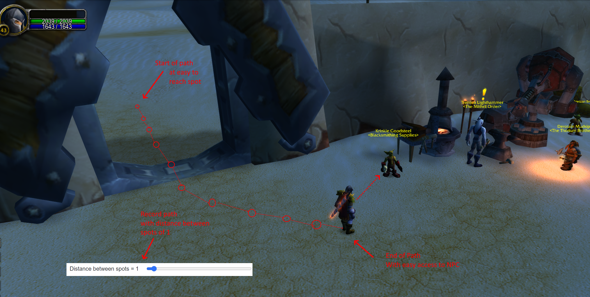

---

#### Auto NPC Route

This is rather an **experimental** feature, and it is known to be unstable but it provides an easy way to add npc interaction in the **current zone**.

With `CrossZoneSearch` enabled, the **current zone** restriction can be bypassed.

The key limitation is the navigation, it is known to get stuck with [Indoors](https://wowwiki-archive.fandom.com/wiki/API_IsIndoors) NPCs — beware of that!

The `"KeyAction.Name"` has a special formula which can be followed to have different behaviour!

* Formula: `[TYPE] {[npc1 | npc2 | npc3 | npcN]}`

The `[TYPE]` can be one of the following
* `Gossip`
* `QuestGiver`
* `Trainer`
* `ClassTrainer`
* `ProfessionTrainer`
* `Vendor` / `Sell`
* `VendorAmmo`
* `VendorFood`
* `VendorPoison`
* `VendorReagent`
* `Repair`
* `FlightMaster`
* `Innkeeper`
* `Banker`
* `StableMaster`

When either zero or list of npc names with `|` separated characters one of the following scenario going to happen:
* When **no** npc name is specified, the **closest** **[TYPE]** of that NPC is considered.
* When **one** npc name is specific, only that npc going to be considered.
* Finally when **one or more** npc name is specified, the **closest** will be picked!

examples of full automatic npc detection or multiple whitelisted names:
```json
"NPC": {
    "Sequence": [
        {
            "Cost": 6,
            "Name": "Repair", // the closest NPC of the Repair(type) is used, highly experimental can lead unexpected behaviours
            "Key": "C",
            "Requirement": "Durability% < 35"
        },
        {
            "Cost": 6,
            "Name": "Sell Adlin Pridedrift | Rybrad Coldbank", // only two npc are consdered of type Vendor
            "Key": "C",
            "Requirements": [
                "BagFull",
                "BagGreyItem"
            ]
        }
    ]
}
```

#### Safe Path Transitions

**Problem:** When bags are full or repairs are needed, the bot immediately abandons the grind path and uses pathfinding to navigate directly to the vendor path start. This direct route may pass through dangerous mob-dense areas, which is especially risky for Hardcore players.

**Solution:** Use the `PathEnd_0` requirement to ensure vendor visits only trigger when you've completed your grind path loop. This way, the bot follows your safe, pre-recorded grind path to its end before transitioning to the vendor path.

**How it works:**
1. Design your grind path so it **ends** near a safe location (close to your vendor path start)
2. Design your vendor path to **start** from that same safe location
3. Add `PathEnd_0` to your vendor requirements
4. The bot will complete the full grind loop before vendoring, avoiding dangerous shortcuts

**Example configuration:**
```json
"NPC": {
    "Sequence": [
        {
            "Name": "Sell Adlin Pridedrift | Rybrad Coldbank",
            "Key": "C",
            "PathFilename": "1_Gnome_Vendor.json",
            "Requirements": [
                "BagFull",
                "BagGreyItem",
                "PathEnd_0"
            ],
            "Cost": 6
        },
        {
            "Name": "Repair",
            "Key": "C",
            "PathFilename": "1_Gnome_Vendor.json",
            "Requirements": [
                "Items Broken",
                "PathEnd_0"
            ],
            "Cost": 6
        }
    ]
}
```

**Notes:**
- `PathEnd_0` refers to the first path (index 0) in your `PathFilename` configuration
- If you have [Multiple Paths with Requirements](#multiple-paths-with-requirements), use `PathEnd_1`, `PathEnd_2`, etc. for other paths
- Use `PathEnd_Any` if you want to trigger when any of your paths reaches its end
- See [PathEnd requirement](#requirement) for more details

---

#### NPC KeyAction.MacroText

When visiting an NPC, it is possible to specify a templated macro text, where the template variables show up as `$` prefixed variables.

If you want to use the template variable you need to first specify it [StringVariables](#stringvariables).

Roughly speaking the following block does the following, if the player has less then 200 

```json
"NPC": {
    "Sequence": [
        {
        "Cost": 6,
        "Name": "VendorAmmo",
        "Requirements": [
            "!BagItem:ITEM_ARROW:MIN_COUNT_ARROW"
        ],
        "MacroText": "/run local a={'$ITEM_NAME_ARROW',$AMMO_SLOT} for i=1,GetMerchantNumItems() do if GetMerchantItemInfo(i)==a[1] then for j=1,a[2] do BuyMerchantItem(i,200) end end end"
        }
    ]
}
```

the final result will be the following

```lua
/run local a={'Rough Arrow',5} for i=1,GetMerchantNumItems() do if GetMerchantItemInfo(i)==a[1] then for j=1,a[2] do BuyMerchantItem(i,200) end end end
```


### Repeatable Quests Handin

In theory if there is a repeatable quest to collect items, you could set up a NPC task as follows. See 'Bag requirements' for [Requirement(s)](#requirement) format.
```json
{
    "Name": "Handin",
    "Key": "K",
    "Requirements": ["BagItem:12622:5","BagItem:12623:5"],
    "PathFilename": "Path_to_NPC.json",
    "Cost": 6
}
```

### Follow Route Goal

Uses the [Path](#path) settings, follows the given route, uses pathfinding depending on the loaded [Class Configuration](#class-configuration)s [Mode](#modes).

Basic informations
* Base cost 20.
* It can be added multiple times via the [Class Configuration.Paths](#class-configuration) property array.

Meanwhile attempts to
* find a new possible non blacklisted target
* find a possible gathering node

# Requirement

Requirements are the brain of your combat rotation. They define **when** each ability should be used.

**Why are Requirements important?**
- Without requirements, the bot would spam abilities randomly
- Requirements let you create intelligent rotations that react to combat situations
- You can prioritize abilities based on health, mana, buffs, debuffs, and more

A requirement is something that must be evaluated to be `true` for the [KeyAction](#keyaction) to run.

Not all [KeyAction](#keyaction) requires requirement(s), some rely on
* `Cooldown` - populated manually (you set how often to use)
* `ActionBarCooldownReader` - populated automatically (reads actual game cooldown)
* `ActionBarCostReader` - populated automatically (checks if you have enough mana/rage/energy)

**Common Requirement Patterns:**

| Pattern | Example | Use Case |
| --- | --- | --- |
| Use on cooldown | No requirement, rely on Cooldown | Main damage abilities |
| Use when buff missing | `"!Battle Shout"` | Self-buffs |
| Use at low health | `"Health% < 30"` | Emergency heals, healthstones |
| Use at high resource | `"Rage > 50"` | Resource dump abilities |
| Use when target debuff missing | `"!Sunder Armor"` | Maintain debuffs on target |
| Use to finish target | `"TargetHealth% < 20"` | Execute-style abilities |

Can specify `Requirements` for complex condition.

e.g.
```json
{
    "Name": "Execute",                                            //<--- Has no Requirement
    "Key": "7",
    "WhenUsable": true
},
{
    "Name": "Soul Shard",
    "Key": "9",
    "HasCastBar": true,
    "Requirements": ["TargetHealth% < 36", "!BagItem:6265:3"]     //<--- Requirement List
},
{
    "Name": "Curse of Weakness",
    "Key": "6",
    "WhenUsable": true,
    "Requirement": "!Curse of Weakness"                           //<--- Single Requirement
}
```

### **Negate a requirement**

Every requirement can be negated by adding one of the `Negate keyword` in front of the requirement.

Formula: `[Negate keyword][requirement]`

| Negate keyword |
| --- |
| `"!"` |

e.g.
```json
"Requirement": "!BagItem:Item_Soul_Shard:3"
```
---

### **And / Or multiple Requirements**

Two or more Requirement can be merged into a single Requirement object. 

By default every Requirement is concatenated with `[and]` operator which means in order to execute the [KeyAction](#keyaction), every member in the `RequirementsObject` must be evaluated to `true`. However this construct allows concatenation with `[or]`. Nesting parenthesis are also supported.

Formula: `[Requirement1] [Operator] [RequirementN]`

| Operator | Description |
| --- | --- |
| "&&" | And |
| "\|\|" | Or |

e.g.
```json
"Requirements": ["Has Pet", "TargetHealth% < 70 || TargetCastingSpell"]
"Requirement": "!Form:Druid_Bear && Health% < 50 || MobCount > 2",
"Requirement": "(Judgement of the Crusader && CD_Judgement <= GCD && TargetHealth% > 20) || TargetCastingSpell"
```
---
### **Value base requirements**

Value base requirement is the most basic way to create a condition. 

Formula: `[Keyword] [Operator] [Numeric integer value]`

**Note:** `[Numeric integer value]` always on the _right-hand_ side expression value

| Operator | Description |
| --- | --- |
| `==` | Equals |
| `!=` | Not Equals |
| `<=` | Less then or Equals |
| `>=` | Greater then or Equals |
| `<` | Less then |
| `>` | Greater then |

Arithmetic operators can be used to build complex expressions:

| Operator | Description |
| --- | --- |
| `+` | Addition |
| `-` | Subtraction |
| `*` | Multiplication |
| `/` | Division |
| `%` | Modulo (returns remainder). For divisibility check use `Deaths % 2 == 0` |

| Keyword | Description |
| --- | --- |
| `Health%` | Player health in percentage |
| `TargetHealth%` | Target health in percentage |
| `FocusHealth%` | Focus health in percentage |
| `PetHealth%` | Pet health in percentage |
| `Mana%` | Player mana in percentage |
| `Mana` | Player current mana |
| `Rage` | Player current rage |
| `Energy` | Player current energy |
| `RunicPower` | Player current runic power |
| `BloodRune` | Player current blood runes |
| `FrostRune` | Player current frost runes |
| `UnholyRune` | Player current unholy runes |
| `TotalRune` | Player current runes (blood+frost+unholy+death) |
| `Combo Point` | Player current combo points on the target |
| `Holy Power` | Player current Holy Power points on the target |
| `Durability%` | Player worn equipment average durability. **0-99** value range. |
| `BagCount` | How many items in the player inventory |
| `FoodCount` | Returns the highest amount of food type, item count |
| `DrinkCount` | Returns the highest amount of drink type, item count |
| `MobCount` | How many detected, alive, and currently fighting mob around the player |
| `MinRange` | Minimum distance(yard) between the player and the target  |
| `MaxRange` | Maximum distance(yard) between the player and the target |
| `LastAutoShotMs` | Time since last detected AutoShot happened in milliseconds |
| `LastMainHandMs` | Time since last detected Main Hand Melee swing happened in milliseconds |
| `SinceDamageTakenMs` | Time in milliseconds since player health last decreased (damage taken) |
| `MainHandSpeed` | Returns the player Main hand attack speed in milliseconds |
| `MainHandSwing` | Returns the player predicted next main hand swing time |
| `RangedSpeed` | Returns the player ranged weapon attack speed in milliseconds |
| `RangedSwing` | Returns the player predicted next ranged weapon swing time |
| `SpellQueueWindow` | Returns SpellQueueWindow C_Var |
| `-SpellQueueWindow` | Returns SpellQueueWindow C_Var negative value. |
| `BowReload` | Returns the default 500ms time plus the player latency.  |
| `CD` | Returns the context [KeyAction](#keyaction) **in-game** cooldown in milliseconds |
| `CD_{KeyAction.Name}` | Returns the given `{KeyAction.Name}` **in-game** cooldown in milliseconds |
| `Cost_{KeyAction.Name}` | Returns the given `{KeyAction.Name}` cost value |
| --- | --- |
| `Buff_{IntVariable_Name}` | Returns the given `{IntVariable_Name}` remaining **player buff** up time in milliseconds |
| `Debuff_{IntVariable_Name}` | Returns the given `{IntVariable_Name}` remaining **player debuff** up time in milliseconds |
| --- | --- |
| `TBuff_{IntVariable_Name}` | Returns the given `{IntVariable_Name}` remaining **target debuff** up time in milliseconds |
| `TDebuff_{IntVariable_Name}` | Returns the given `{IntVariable_Name}` remaining **target debuff** up time in milliseconds |
| --- | --- |
| `FBuff_{IntVariable_Name}` | Returns the given `{IntVariable_Name}` remaining **focus buff** up time in milliseconds |
| --- | --- |
| `CurGCD` | Returns the player current remaining GCD time |
| `GCD` | Alias for `1500` value |
| `Kills` | In the current session how many mobs have been killed by the player. |
| `Deaths` | In the current session how many times the player have died. |
| `Level` | Returns with the player current level. |
| `SessionSeconds` | Returns with the elapsed time in Seconds since the Session started.<br>The Session starts when the `Start Bot` button is pressed! |
| `SessionMinutes` | Returns with the elapsed time in Minutes since the Session started.<br>The Session starts when the `Start Bot` button is pressed! |
| `SessionHours` | Returns with the elapsed time in Hours since the Session started.<br>The Session starts when the `Start Bot` button is pressed! |
| `ExpPerc` | Returns with the player experience as percentage to hit next level. |
| `UIMapId` | Returns with the player current [UIMapId](https://github.com/Xian55/WowClassicGrindBot/blob/9bea201760babc0f6670df2bd5c071c9c3f1220d/Json/dbc/som/WorldMapArea.json#L3C6-L3C11) |
| `PathDist` | Returns the context [PathSettings](#pathsettings) of closest distance (in yards) from the player location to the Path. |
| `PathDist_{PathSettings.Id}` | Returns the closest distance (in yards) from the player location to the Path. |

For the `MinRange` and `MaxRange` gives an approximation range distance between the player and target.

**Note:** _Every class has its own unique way to find these values by using different in game items/spells/interact._

| MinRange | MaxRange | alias Description |
| --- | --- | --- |
| 0 | 2 | "InCloseMeleeRange" |
| 0 | 5 | "InMeleeRange" |
| 5 | 15 | "IsInDeadZoneRange" |

Its worth mention that `CD_{KeyAction.Name}` is a dynamic value.<br>Each [KeyAction](#keyaction) has its own `in-game Cooldown` which is not the same as `KeyAction.Cooldown`!

e.g. Single Requirement
```json
"Requirement": "Health%>70"
"Requirement": "TargetHealth%<=10"
"Requirement": "PetHealth% < 10"
"Requirement": "Mana% <= 40"
"Requirement": "Mana < 420"
"Requirement": "Energy >= 40"
"Requirement": "Rage > 90"
"Requirement": "BagCount > 80"
"Requirement": "MobCount > 1"
"Requirement": "MinRange < 5"
"Requirement": "MinRange > 15"
"Requirement": "MaxRange > 20"
"Requirement": "MaxRange > 35"
"Requirement": "LastAutoShotMs <= 500"
"Requirement": "LastMainHandMs <= 500"
"Requirement": "SinceDamageTakenMs < 5000"
"Requirement": "CD_Judgement < GCD"                 // The remaining cooldown on Judgement is less then GCD(1500)
"Requirement": "CD_Hammer of Justice > CD_Judgement" // The remaining cooldown on Hammer of Justice is greater then 8 seconds
"Requirement": "Rage >= Cost_Heroic Strike"          // Create a condition like if player current rage is greater then or equal the cost of Heroic Strike
"Requirement": "MainHandSpeed > 3500"   // Main hand attack speed is greater then 3.5 seconds
"Requirement": "MainHandSwing > -400"   // 400 milliseconds before next predicted main swing happen
"Requirement": "MainHandSwing > -400"   // 400 milliseconds before next predicted main swing happen
"Requirement": "Dead && Deaths % 2"           // Player is currently dead and died for the second time in the current session
"Requirement": "Deaths % 2 == 1"              // Player died odd number of times (explicit comparison)
"Requirement": "Energy - Cost_Sinister_Strike >= 0"  // Enough energy remaining after cast
```

e.g. List of Requirements
```json
"Requirements": [
    "TargetHealth% > DOT_MIN_HEALTH%",  // where DOT_MIN_HEALTH% is a user defined variable
    "!Immolate"
],
```

#### Complex Expressions

Both sides of a comparison can be full arithmetic expressions mixing variables, constants, and operators. Parentheses control evaluation order, and standard math precedence applies (`*`/`/`/`%` bind tighter than `+`/`-`).

e.g.
```json
"Requirement": "(Health% + Mana%) / 2 > 50"             // Average of health and mana above 50%
"Requirement": "Energy - Cost_Sinister_Strike >= 0"      // Enough energy after spell cost
"Requirement": "MainHandSwing > -SpellQueueWindow"       // Swing timer vs queue window
"Requirement": "SessionMinutes % 40 < 20"                // First 20 min of every 40 min cycle
"Requirement": "Kills % 5 == 0 && SessionMinutes > 10"   // Every 5th kill after 10 minutes
```

e.g. for `CD`: It's a good idea to put `CD` in healing spells to take consideration of the spell interruption.
```json
{
    "Name": "Flash of Light",
    "Key": "6",
    "HasCastBar": true,
    "WhenUsable": true,
    "Requirements": ["Health% < 60", "TargetHealth% > 20", "CD == 0", "MobCount < 2", "LastMainHandMs <= 1000"],
    "Cooldown": 6000
},
```

e.g. for `CD_{KeyAction.Name}`: Where `Hammer of Justice` referencing the `Judgement` **in-game** Cooldown to do an awesome combo!
```json
{
    "Name": "Judgement",
    "Key": "1",
    "WhenUsable": true,
    "Requirements": ["Seal of the Crusader", "!Judgement of the Crusader"]
},
{
    "Name": "Hammer of Justice",
    "Key": "7",
    "WhenUsable": true,
    "Requirements": ["Judgement of the Crusader && CD_Judgement <= GCD && TargetHealth% > 20 || TargetCastingSpell"]
}
```
---
### **npcID requirements**

If a particular npc is required then this requirement can be used.

Formula: `npcID:[intVariableKey/Numeric integer value]`

e.g.

* `"Requirement": "!npcID:6195"` - target is not [6195](https://tbc.wowhead.com/npc=6195)
* `"Requirement": "npcID:6195"` - target is [6195](https://tbc.wowhead.com/npc=6195)
* `"Requirement": "npcID:MyAwesomeIntVariable"`

---
### **Bag requirements**

If an `itemid` must be in your bag with given `count` quantity then can use this requirement. 

Useful to determine when to create warlock Healthstone or soul shards.

Formula: `BagItem:[intVariableKey/itemid]:[count/IntVariablesKey]`

e.g.

* `"Requirement": "BagItem:5175"` - Must have a [Earth Totem](https://tbc.wowhead.com/item=5175) in bag
* `"Requirement": "BagItem:Item_Soul_Shard:3"` - Must have at least [3x Soulshard](https://tbc.wowhead.com/item=6265) in bag
* `"Requirement": "!BagItem:19007:1"` - Must not have a [Lesser Healthstone](https://tbc.wowhead.com/item=19007) in bag
* `"Requirement": "!BagItem:6265:3"` - Must not have [3x Soulshard](https://tbc.wowhead.com/item=6265) in bag
* `"Requirement": "!BagItem:MyAwesomeIntVariable:69"`

---
### **Form requirements**

If the player must be in the specified `form` use this requirement. 

Useful to determine when to switch Form for the given situation.

Formula: `Form:[form]`

| form |
| --- |
| None
| Druid_Bear |
| Druid_Aquatic |
| Druid_Cat |
| Druid_Travel |
| Druid_Moonkin |
| Druid_Flight |
| Druid_Cat_Prowl |
| Priest_Shadowform |
| Rogue_Stealth |
| Rogue_Vanish |
| Shaman_GhostWolf |
| Warrior_BattleStance |
| Warrior_DefensiveStance |
| Warrior_BerserkerStance |
| Paladin_Devotion_Aura |
| Paladin_Retribution_Aura |
| Paladin_Concentration_Aura |
| Paladin_Shadow_Resistance_Aura |
| Paladin_Frost_Resistance_Aura |
| Paladin_Fire_Resistance_Aura |
| Paladin_Sanctity_Aura |
| Paladin_Crusader_Aura |
| DeathKnight_Blood_Presence |
| DeathKnight_Frost_Presence |
| DeathKnight_Unholy_Presence |

e.g.
```json
"Requirement": "Form:Druid_Bear"    // Must be in `Druid_Bear` form
"Requirement": "!Form:Druid_Cat"    // Shouldn't be in `Druid_Cat` form
```

---
### **Race requirements**

If the character must be the specified `race` use this requirement. 

Useful to determine Racial abilities.

Formula: `Race:[race]`

| race | 
| --- |
| None |
| Human |
| Orc |
| Dwarf |
| NightElf |
| Undead |
| Tauren |
| Gnome |
| Troll |
| Goblin |
| BloodElf |
| Draenei |

e.g. 
```json
"Requirement": "Race:Orc"          // Must be `Orc` race
"Requirement": "!Race:Human"    // Shouldn't be `Human` race
```

---
### **Target requirements**

If the current target must be a specific creature type use this requirement. Uses the DBC creature database to look up the target's type by NPC ID.

Useful for abilities that only work on certain creature types (e.g. Paladin's Exorcism on Undead/Demon).

Formula: `Target:[type]`

| type |
| --- |
| Beast |
| Dragonkin |
| Demon |
| Elemental |
| Giant |
| Undead |
| Humanoid |
| Critter |
| Mechanical |
| NotSpecified |
| Totem |
| NonCombatPet |
| GasCloud |

e.g.
```json
"Requirement": "Target:Undead"                          // Target must be Undead
"Requirement": "Target:Demon"                             // Target must be Demon
"Requirement": "!Target:Humanoid"                         // Target must not be Humanoid
"Requirement": "Target:Undead || Target:Demon"            // Target is Undead or Demon
```

---
### **MouseOver requirements**

If the current mouseover must be a specific creature type use this requirement. Uses the DBC creature database to look up the mouseover's type by NPC ID.

Formula: `MouseOver:[type]`

| type |
| --- |
| Beast |
| Dragonkin |
| Demon |
| Elemental |
| Giant |
| Undead |
| Humanoid |
| Critter |
| Mechanical |
| NotSpecified |
| Totem |
| NonCombatPet |
| GasCloud |

e.g.
```json
"Requirement": "MouseOver:Undead"                          // MouseOver must be Undead
"Requirement": "MouseOver:Demon"                           // MouseOver must be Demon
"Requirement": "!MouseOver:Humanoid"                       // MouseOver must not be Humanoid
"Requirement": "MouseOver:Undead || MouseOver:Demon"       // MouseOver is Undead or Demon
```

---
### **Equipment requirements**

Check if the player has an item equipped in the specified `slot`. Optionally check for a specific `itemId`.

Useful to determine weapon availability for combat rotations (e.g., dual-wield classes, ranged pulls).

Formula: `Equipment:[slot]` or `Equipment:[slot]:[itemId]`

| slot |
| --- |
| Ammo |
| Head |
| Neck |
| Shoulder |
| Shirt |
| Chest |
| Waist |
| Legs |
| Feet |
| Wrists |
| Hands |
| Finger_1 |
| Finger_2 |
| Trinket_1 |
| Trinket_2 |
| Back |
| Mainhand |
| Offhand |
| Ranged |
| Tabard |

e.g.
```json
"Requirement": "Equipment:Mainhand"                        // Must have main hand weapon equipped
"Requirement": "!Equipment:Offhand"                        // Should not have off hand equipped
"Requirement": "Equipment:Mainhand && Equipment:Offhand"   // Must be dual-wielding
"Requirement": "Equipment:Mainhand:4513"                   // Must have item 4513 equipped in main hand
```

---
### **Spell requirements**

If a given Spell `name` or `id` must be known by the player then you can use this requirement. 

Useful to determine when the given `Spell` is exists in the spellbook.

It has the following formulas:

* `Spell:[name]`. The `name` only works with the English client name.
* `Spell:[id]`

e.g.

* `"Requirement": "Spell:687"` - Must have know [`id=687`](https://tbc.wowhead.com/item=687)
* `"Requirement": "Spell:Demon Skin"` - Must have known the given `name`
* `"Requirement": "!Spell:702"` - Must not have known the given [`id=702`](https://tbc.wowhead.com/item=702)
* `"Requirement": "!Spell:Curse of Weakness"` - Must not have known the given `name`

---
### **Talent requirements**

If a given Talent `name` must be known by the player then you can use this requirement. 

Useful to determine when the given Talent is learned. Also can specify how many points have to be spent minimum with `rank` which can be constant or a variable in [`IntVariables`](#intvariables)

Formula: `Talent:[name]:[rank/IntVariablesKey]`. The `name` only works with the English client name.

e.g.

```json
"Requirement": "Talent:Improved Corruption"    // Must known the given `name`
"Requirement": "Talent:Improved Corruption:5"  // Must know the given `name` and at least with `rank`
"Requirement": "!Talent:Suppression"        // Must have not know the given `name`
```
---
### **Player Buff remaining time requirements**

First in the [`IntVariables`](#intvariables) have to mention the buff icon id such as `Buff_{your fancy name}: {icon_id}`.

It is important, the addon keeps track of the **icon_id**! Not **spell_id**

e.g.
```json
"IntVariables": {
    "Buff_Horn of Winter": 134228
},
```

Then in [KeyAction](#keyaction) you can use the following requirement:

e.g.
```json
{
    "Cost": 3.1,
    "Name": "Horn of Winter",
    "Key": "F4",
    "InCombat": "i dont care",
    "WhenUsable": true,
    "Requirements": [
        "Buff_Horn of Winter < 5000", // The remaining time is less then 5 seconds
        "!Mounted"
    ],
    "AfterCastWaitBuff": true
}     
```
---
### **Player Debuff remaining time requirements**

First in the [`IntVariables`](#intvariables) have to mention the debuff icon id such as `Debuff_{your fancy name}: {icon_id}`.

It is important, the addon keeps track of the **icon_id**! Not **spell_id**

A single icon id:
```json
"IntVariables": {
    "Debuff_Poison": 135368
},
```

An **array of icon ids** — the variable returns the max remaining time across all listed icons, so the requirement is true when **any** of them is active:
```json
"IntVariables": {
    "Debuff_POISON": [136006, 136007, 136016, 136064, 136067, 136077, 136093, 134437, 132273, 132274, 132105],
    "Debuff_DISEASE": [136127, 136134, 134324, 135914]
},
```

Then in [KeyAction](#keyaction) you can use the following requirement:

e.g.
```json
{
    "Name": "Stoneform",
    "Key": "F11",
    "Requirements": [
        "Debuff_POISON > 1 || Debuff_DISEASE > 1"
    ]
}
```
---
### **Target Debuff remaining time requirements**

First in the [`IntVariables`](#intvariables) have to mention the debuff icon id such as `TDebuff_{your fancy name}: {icon_id}`

It is important, the addon keeps track of the **icon_id**! Not **spell_id**

e.g.
```json
"IntVariables": {
    "TDebuff_Blood Plague": 237514,
    "TDebuff_Frost Fever": 237522
},
```

Then in [KeyAction](#keyaction) you can use the following requirement:

e.g.
```json
{
    "Name": "Pestilenc",
    "Key": "F6",
    "WhenUsable": true,
    "Requirements": [
        "Frost Fever && Blood Plague && (TDebuff_Frost Fever < 2000 || TDebuff_Blood Plague < 2000)",   // Frost Fever and Blood Plague is up
        "InMeleeRange"                                                                                // and their duration less then 2 seconds
    ]
}
```
---
### **Target Buff remaining time requirements**

First in the [IntVariables](#intvariables) have to mention the buff icon id such as `TBuff_{your fancy name}: {icon_id}`

It is important, the addon keeps track of the **icon_id**! Not **spell_id**

e.g.
```json
"IntVariables": {
    "TBuff_Battle Shout": 132333,
},
```
---
### **Focus Buff remaining time requirements**

First in the [IntVariables](#intvariables) have to mention the buff icon id such as `FBuff_{your fancy name}: {icon_id}`

It is important, the addon keeps track of the **icon_id**! Not **spell_id**

e.g.
```json
"IntVariables": {
    "FBuff_Battle Shout": 132333,
    "FBuff_Mount": 132239
},
```
---
### **CanRun requirements**

Formula: `CanRun:_KeyAction_Name_`

Where the `_KeyAction_Name_` is one of the [KeyAction.Name](#keyaction).

It is suitable for [Interrupt Requirement](#interrupt-requirement), for such scenario:
* The player already casting a `Castbar` based spell which has a long cast time like 2-3 seconds
* However meanwhile a higher priority action can be used, which would be beneficial.
* Like: A mob is in low hp, so an instant cast spell such as `Earth Shock`, `Fireblast` would execute the enemy.

e.g.
```json
"Requirement": "CanRun:Frost Shock"
"Requirement": "CanRun:Fire Blast"
"Requirement": "!CanRun:Heartstone"
```

---
### **Trigger requirements**

If you feel the current Requirement toolset is not enough for you, you can use other addons such as **WeakAura's** Trigger to control a given bit.

1. **The regarding in-game Addon API is looks like this**

    ```lua
    YOUR_CHOOSEN_ADDON_NAME_FROM_ADDON_CONFIG:Set(bit, value)
    -- bit: 0-23
    -- value: 0 or 1 or true or false

    --e.g. by using default addon name
    DataToColor:Set(0,1)
    DataToColor:Set(0,0)
    DataToColor:Set(23,true)
    DataToColor:Set(23,false)
    ```

    e.g. you can make your awesome WeakAura. Then you can put the following Addon API in the

    WeakAura -> Actions -> On Show -> Custom
    ```lua
    DataToColor:Set(0,1) -- enable Trigger 0
    ```

    WeakAura -> Actions -> On Hide -> Custom
    ```lua
    DataToColor:Set(0,0)  -- disable Trigger 0
    ```

    Example Weakaura for hunter pet in 10y range for feed pet
    ```lua
    !WA:2!1rvWUTTrq0O6dPGOiXXT1afTaLWT1ibTiW2fnfOO9GOmvScKTuiPJtApqUK7qXnMC3f7Uu2khf6HCwFc6CpXpH8fqi0Va)j4VGUlPQHBrIoioZUZS78EZ82o93Qyl8w43(DcwPkNqbXOtdgo4exXLJstLGQtfMi55OzbWLQpALmdHzx8Q29(Q7uHOjzmXygHQI75EsGRh3(wjeMYefivipurkG1ED4BMukvScteNYXif4btbQ6kuPEvKIKCgbRYC6QDfOefHrLpXtQqc1UlWSW2SJIB)Y)SdrkuaRhlNj(fFq9W9(H9FKdHsuBxF)S4uTLmB367hvV57l29E0CLGmzciK3BxXAZ3(1ZjkO4eub05kzzCt9nwaPKl98h7oC41LsiSaKs0eiyghIENzH)nNi(dmUtanHss8ZyxmIgT6)4ELS5tpglxZO05M4l11CKJ5)d4GYtGOtGD2FVQMJMovxHqwtGzikoAHKd55nLOJsxc12x1KriJdcKM625x)TLyiUmn1uHIJChoU)Pdx0Gftc8pF8WUVY1l0Z9PUNeE4a)UodDpCL5gsB59bhgDd891he5YQWED9dc9d66f0e5nhxuScLRTTCm9zRARkpt5y3ldsoVHEIHm0uctKTsaOC)Bk)MZ5g0enVXCawATWSrdOIQUfHN5r1XTEBLEe58OQB1l4B27OUbHh7)0WZoAGUD5TOKUUXAXFGbztHGw)Jzy4VUd)lFVdTTgEMzx816rCqqr5Vq3g0mZFSqc5PTt(oJccgDSg2ufFZ(cYBSFEjcR7bi7GGLA(ZdMygITCYzi8lAk7KCKugvV32EfL5kILJg0jBxpWYRzNDJLe6KCi(OtnQk96osYBataZn3JV25lwlhFzRCCJLIMRXqboknqwMWOysJ8XI)nFyzjxajedM2yLwbQ1ZJ4TjjMT(raXR1sns6m94r)GLkwY0ws4JhV9oem)BZknKJTEO1MqT3FVz2nnnB99yNca2SZbLeCL354H)0lF4Zrf)EvQq3e9vgAAJRBFiPVzjt9h73ZZ19eVeJq9zBO)fRbtkzI18lyc8zceF(zRn4F)hgA4z6jfssOktaAbxoEwvlN18cWZ60PZgl1d1aU5fN)8tQi02dqdoRfikP18j13RF9UougfEhGKMQgOtuz3DfUu0erOrbO1Ngkxo3eJbg1eNceHQZTMu)67wFEDEDH28t))RSL07hF8p)4d2A6F)Y)5
    ```

1. **Then outside of the game, you can specify the following in the [Class Configuration](#class-configuration) file ex. `class/Hunter_62.json`**

    Formula: `Trigger:[bit]:[name]`

    Where the `bit` is 0-23 and the `name` is a free text which shows up in the frontend.

    e.g.
    ```json
    "Requirement": "Trigger:0:Pet in range"           // Trigger 0 must be true
    "Requirement": "Trigger:23:My Awesome trigger"    // Trigger 23 must be true
    "Requirement": "!Trigger:6:Suppression"        // Trigger 6 must be false
    ```
---
### **Buff / Debuff / General boolean condition requirements**

Allow requirements about what buffs/debuffs you have or the target has or in general some boolean based requirements.

| General boolean condition | Description |
| --- | --- |
| `"TargetYieldXP"` | The target yields experience upon death. (Grey Level) |
| `"TargetsMe"` | The target currently targets the player |
| `"TargetsPet"` | The target currently targets the player's pet |
| `"TargetsNone"` | The target currently has not target |
| `"TargetElite"` | The target is Elite [unit classification](https://wowpedia.fandom.com/wiki/API_UnitClassification) |
| `"SoftTarget"` | The player has an available soft target |
| `"SoftTargetDead"` | The player has an available soft target which is dead |
| `"AddVisible"` | Around the target there are possible additional NPCs |
| `"InCombat"` | Player in combat. |
| `"TargetCastingSpell"` | Target casts any spell |
| `"Swimming"` | The player is currently swimming. |
| `"Falling"` | The player is currently falling down, not touching the ground. |
| `"Flying"` | The player is currently flying, not touching the ground. |
| `"MenuOpen"` | Returns true if the Game Menu window is open (ESC) |
| `"ChatInputVisible"` | Returns true if the Chat inputbox is open (ENTER) |
| `"AnyBagOpen"` | Returns true if any bag frame is visible on screen |
| `"CharacterFrameOpen"` | Returns true if the Character Info window is open (C) |
| `"SpellBookFrameOpen"` | Returns true if the Spellbook window is open (P) |
| `"FriendsFrameOpen"` | Returns true if the Social/Friends window is open (O) |
| `"Dead"` | The player is currently dead. |
| `"CannibalizeCorpse"` | A Humanoid or Undead corpse is within 5 yards of the player. |
| `"DamageTakenFromTotem"` | The player has taken damage from a Totem creature type. Useful to detect nearby totems. |
| `"Has Pet"` | The player's pet is alive |
| `"Pet HasTarget"` | Players pet has target |
| `"Pet Happy"` | Pet happiness is green |
| `"Mounted"` | Player riding on a mount (druid form excluded) |
| `"BagFull"` | Inventory is full |
| `"BagGreyItem"` | Indicates that there are at least one Grey Quality level item. |
| `"Items Broken"` | Has any broken(red) worn item |
| `"HasRangedWeapon"` | Has equipped ranged weapon (wand/crossbow/bow/gun) |
| `"HasAmmo"` | AmmoSlot has equipped ammo and count is greater than zero |
| `"Casting"` | The player is currently casting any spell. |
| `"HasTarget"` | The player currently has a target. |
| `"TargetAlive"` | The player currently has an alive target. |
| `"TargetHostile"` | The player currently target is hostile. |
| `"InMeleeRange"` | Target is approximately 0-5 yard range |
| `"InCloseMeleeRange"` | Target is approximately 0-2 yard range |
| `"InDeadZoneRange"` | Target is approximately 5-11 yard range |
| `"InCombatRange"` | Class based - Have any ability which allows you to attack target from current place |
| `"OutOfCombatRange"` | Negated value of "InCombatRange" |
| `"AutoAttacking"` | Auto spell `Auto Attack` is active |
| `"Shooting"` | (wand) Auto spell `Shoot` is active |
| `"AutoShot"` | (hunter) Auto spell `Auto Shot` is active |
| `"HasMainHandEnchant"` | Indicates that main hand weapon has active poison/sharpening stone/shaman buff effect |
| `"HasOffHandEnchant"` | Indicates that off hand weapon has active poison/sharpening stone/shaman buff effect |
| `"PathEnd_{PathSettings.Id}"` | Returns true when:<br/>* Player has not yet started walking along the path.<br/>* or reached the destination of the path.<br/>**Note**: path can be reversed based on the [PathSettings.PathThereAndBack](#pathsettings)! |
| `"PathEnd_Any"` | Same as the above, However returns true when any of is true. |

<table>
<tr><th>Buffs</th><th>Debuffs</th></tr>
<tr valign="top"><td>

| Class | Buff Condition |
| --- | --- |
| All | `"Well Fed"` |
| All | `"Eating"` |
| All | `"Drinking"` |
| All | `"Mana Regeneration"` |
| All | `"Clearcasting"` |
| Druid | `"Mark of the Wild"` |
| Druid | `"Thorns"` |
| Druid | `"Tiger's Fury"` |
| Druid | `"Prowl"` |
| Druid | `"Rejuvenation"` |
| Druid | `"Regrowth"` |
| Druid | `"Omen of Clarity"` |
| Mage | `"Frost Armor"` |
| Mage | `"Ice Armor"` |
| Mage | `"Molten Armor"` |
| Mage | `"Mage Armor"` |
| Mage | `"Arcane Intellect"` |
| Mage | `"Ice Barrier"` |
| Mage | `"Ward"` |
| Mage | `"Fire Power"` |
| Mage | `"Mana Shield"` |
| Mage | `"Presence of Mind"` |
| Mage | `"Arcane Power"` |
| Paladin | `"Seal of Righteousness"` |
| Paladin | `"Seal of the Crusader"` |
| Paladin | `"Seal of Command"` |
| Paladin | `"Seal of Wisdom"` |
| Paladin | `"Seal of Light"` |
| Paladin | `"Seal of Blood"` |
| Paladin | `"Seal of Vengeance"` |
| Paladin | `"Blessing of Might"` |
| Paladin | `"Blessing of Protection"` |
| Paladin | `"Blessing of Wisdom"` |
| Paladin | `"Blessing of Kings"` |
| Paladin | `"Blessing of Salvation"` |
| Paladin | `"Blessing of Sanctuary"` |
| Paladin | `"Blessing of Light"` |
| Paladin | `"Righteous Fury"` |
| Paladin | `"Divine Protection"` |
| Paladin | `"Avenging Wrath"` |
| Paladin | `"Holy Shield"` |
| Paladin | `"Divine Shield"` |
| Priest | `"Fortitude"` |
| Priest | `"Inner Fire"` |
| Priest | `"Divine Spirit"` |
| Priest | `"Renew"` |
| Priest | `"Shield"` |
| Priest | `"Spirit"` |
| Priest | `"Inner Focus"` |
| Priest | `"Abolish Disease"` |
| Priest | `"Power Infusion"` |
| Priest | `"Prayer of Shadow Protection"` |
| Priest | `"Shadow Protection"` |
| Rogue | `"Slice And Dice"` |
| Rogue | `"Stealth"` |
| Warlock | `"Demon Armor"` |
| Warlock | `"Demon Skin"` |
| Warlock | `"Shadow Trance"` |
| Warlock | `"Soulstone Resurrection"` |
| Warlock | `"Soul Link"` |
| Warlock | `"Fel Armor"` |
| Warlock | `"Fel Domination"` |
| Warlock | `"Demonic Sacrifice"` |
| Warlock | `"Sacrifice"` |
| Warrior | `"Battle Shout"` |
| Warrior | `"Bloodrage"` |
| Shaman | `"Lightning Shield"` |
| Shaman | `"Water Shield"` |
| Shaman | `"Shamanistic Focus"` |
| Shaman | `"Focused"` |
| Shaman | `"Stoneskin"` |
| Shaman | `"Elemental Mastery"` |
| Shaman | `"Stormstrike"` |
| Shaman | `"Nature's Swiftness"` |
| Hunter | `"Aspect of the Cheetah"` |
| Hunter | `"Aspect of the Pack"` |
| Hunter | `"Aspect of the Hawk"` |
| Hunter | `"Aspect of the Monkey"` |
| Hunter | `"Aspect of the Viper"` |
| Hunter | `"Aspect of the Dragonhawk"` |
| Hunter | `"Lock and Load"` |
| Hunter | `"Rapid Fire"` |
| Hunter | `"Quick Shots"` |
| Hunter | `"Trueshot Aura"` |
| Death Knight | `"Blood Tap"` |
| Death Knight | `"Horn of Winter"` |
| Death Knight | `"Icebound Fortitude"` |
| Death Knight | `"Path of Frost"` |
| Death Knight | `"Anti-Magic Shell"` |
| Death Knight | `"Army of the Dead"` |
| Death Knight | `"Vampiric Blood"` |
| Death Knight | `"Dancing Rune Weapon"` |
| Death Knight | `"Unbreakable Armor"` |
| Death Knight | `"Bone Shield"` |
| Death Knight | `"Summon Gargoyle"` |
| Death Knight | `"Freezing Fog"` |

</td>
<td valign="top">

| Class | Debuff Condition |
| --- | --- |
| Druid | `"Demoralizing Roar"` |
| Druid | `"Faerie Fire"` |
| Druid | `"Rip"` |
| Druid | `"Moonfire"` |
| Druid | `"Entangling Roots"` |
| Druid | `"Rake"` |
| Paladin | `"Judgement of the Crusader"` |
| Paladin | `"Hammer of Justice"` |
| Paladin | `"Judgement of Wisdom"` |
| Paladin | `"Judgement of Light"` |
| Paladin | `"Judgement of Justice"` |
| Paladin | `"Judgement of Any"` |
| Mage | `"Frostbite"` |
| Mage | `"Slow"` |
| Priest | `"Shadow Word: Pain"` |
| Priest | `"Holy Fire"` |
| Priest | `"Vampiric Embrace"` |
| Priest | `"Silence"` |
| Priest | `"Shackle Undead"` |
| Warlock | `"Curse of"` |
| Warlock | `"Curse of Weakness"` |
| Warlock | `"Curse of Elements"` |
| Warlock | `"Curse of Recklessness"` |
| Warlock | `"Curse of Shadow"` |
| Warlock | `"Curse of Agony"` |
| Warlock | `"Siphon Life"` |
| Warlock | `"Corruption"` |
| Warlock | `"Immolate"` |
| Warrior | `"Rend"` |
| Warrior | `"Thunder Clap"` |
| Warrior | `"Hamstring"` |
| Warrior | `"Charge Stun"` |
| Hunter | `"Serpent Sting"` |
| Hunter | `"Hunter's Mark"` |
| Hunter | `"Viper Sting"` |
| Hunter | `"Explosive Shot"` |
| Hunter | `"Black Arrow"` |
| Death Knight | `"Blood Plague"` |
| Death Knight | `"Frost Fever"` |
| Death Knight | `"Strangulate"` |
| Death Knight | `"Chains of Ice"` |

</td></tr> </table>

e.g.
```json
"Requirement": "!Well Fed"         // I am not well fed.
"Requirement": "!Thorns"           // I don't have the thorns buff.
"Requirement": "AutoAttacking"     // "Auto Attack" spell is active.
"Requirement": "Shooting"          // "Shoot" spell is active.
"Requirement": "Items Broken"      // Worn armor is broken (red).
"Requirement": "BagFull"           // Inventory is full.
"Requirement": "HasRangedWeapon"   // Has an item equipped at the ranged slot.
"Requirement": "InMeleeRange"      // Determines if the target is in melee range (0-5 yard)
"Requirement": "!F_Thorns"         // Focus don't have the thorns buff.
"Requirement": "F_Rejuvenation"    // Focus Has Rejuvenation buff active.
```

---
### **SpellInRange requirements**

Allow requirements about spell range to be used, the spell in question depends upon the class being played.

`"SpellInRange:0"` or `"!SpellInRange:0"` for a Warrior is Charge and for a Mage is Fireball.

This might be useful if you were close enough for a Fireball, but not for a Frostbolt.

Formula: `SpellInRange:[Numeric integer value/IntVariablesKey]`

| Class | Spell | id |
| --- | --- | --- |
| Rogue | Sinister Strike | 0 |
| Rogue | Throw | 1 |
| Rogue | Shoot Gun | 2 |
| Druid | Wrath | 0 |
| Druid | Bash | 1 |
| Druid | Rip | 2 |
| Druid | Maul | 3 |
| Druid | Healing Touch | 4 |
| Druid | Mark of the Wild | 5 |
| Druid | Regrowth | 6 |
| Druid | Rejuvenation | 7 |
| Druid | Thorns | 8 |
| Warrior | Charge | 0 |
| Warrior | Rend | 1 |
| Warrior | Shoot Gun | 2 |
| Warrior | Throw | 3 |
| Priest | Shadow Word: Pain | 0 |
| Priest | Shoot | 1 |
| Priest | Mind Flay | 2 |
| Priest | Mind Blast | 3 |
| Priest | Smite | 4 |
| Priest | Divine Spirit | 5 |
| Priest | Power Word: Fortitude | 6 |
| Priest | Power Word: Shield | 7 |
| Priest | Lesser Heal | 8 |
| Priest | Prayer of Mending | 9 |
| Priest | Renew | 10 |
| Priest | Shadow Protection | 11 |
| Paladin | Judgement | 0 |
| Paladin | Exorcism | 1 |
| Paladin | Flash Heal | 2 |
| Paladin | Holy Light | 3 |
| Paladin | Blessing of * | 4 |
| Paladin | Greater Blessing of * | 5 |
| Mage | Fireball | 0 |
| Mage | Shoot| 1 |
| Mage | Pyroblast | 2 |
| Mage | Frostbolt | 3 |
| Mage | Fire Blast | 4 |
| Hunter | Raptor Strike | 0 |
| Hunter | Auto Shot | 1 |
| Hunter | Serpent Sting | 2 |
| Hunter | Feed Pet | 3 |
| Warlock | Shadow Bolt | 0 |
| Warlock | Shoot | 1 |
| Warlock | Health Funnel | 2 |
| Shaman | Lightning Bolt | 0 |
| Shaman | Earth Shock | 1 |
| Shaman | Healing Wave | 2 |
| Shaman | Lesser Healing Wave | 3 |
| Shaman | Water Breathing | 4 |
| Shaman | Chain Heal | 5 |
| Shaman | Earth Shield | 6 |
| Death Knight | Icy Touch | 0 |
| Death Knight | Death Coil | 1 |
| Death Knight | Death Grip | 2 |
| Death Knight | Dark Command | 3 |
| Death Knight | Raise Dead | 4 |

Shared [CheckInteractDistance](https://wowwiki-archive.fandom.com/wiki/API_CheckInteractDistance) API

**Note:** It only works outside of combat since [16th Nov 2023](https://twitter.com/WeakAuras/status/1725238451421782093)

| Unit | id |
| --- | --- |
| focustarget Inspect | 12 |
| focustarget Trade | 13 |
| focustarget Duel | 14 |
| focus Inspect | 15 |
| focus Trade | 16 |
| focus Duel | 17 |
| pet Inspect | 18 |
| pet Trade | 19 |
| pet Duel | 20 |
| target Inspect | 21 |
| target Trade | 22 |
| target Duel | 23 |

e.g.
```json
"Requirement": "SpellInRange:4"
"Requirements": ["Health% < 80", "SpellInRange:2"]
```

---
### **Target Casting Spell requirement**

Combined with the `KeyAction.UseWhenTargetIsCasting` property, this requirement can limit on which enemy target spell your character will react or ignore.

Firstly `"TargetCastingSpell"` as it is without mentioning any spellID. Simply tells if the target is doing any cast at all.

Secondly can specify the following Format `"TargetCastingSpell:spellID1,spellID2,..."` which translates to "if Target is casting spellID1 OR spellID2 OR ...".

e.g. Rogue_20.json
```json
{
    "Name": "Kick",
    "UseWhenTargetIsCasting": true
},
{
    "Name": "Kick",
    "Requirement": "!TargetCastingSpell"
},
{
    "Name": "Kick",
    "UseWhenTargetIsCasting": true,
    "Requirement": "TargetCastingSpell:9053,11443"
},
{
    "Name": "Kick",
    "Requirement": "!TargetCastingSpell:11443"
}
```

# Interrupt Requirement

**Why Interrupt Requirements?** Some abilities take time (channeling, long casts, movement abilities). Interrupt Requirements let you abort these early when conditions change - for example, stop casting a heal if the target dies, or stop kiting when the enemy starts casting.

Every [KeyAction](#keyaction) has individual Interrupt(s) condition(s) which are [Requirement(s)](#requirement) to stop execution before fully finishing it.

As of now every [Goal groups](#goal-groups) has a default Interrupt.
* [Flee Goal](#flee-goal) based [KeyAction(s)](#keyaction) interrupted once the player left combat.
* [Combat Goal](#combat-goal) based [KeyAction(s)](#keyaction) interrupted once the target dies and the player loses the target.
* [Parallel Goal](#parallel-goals) based [KeyAction(s)](#keyaction) has **No** interrupt conditions.
* [Adhoc Goals](#adhoc-goals) based [KeyAction(s)](#keyaction) depends on `KeyAction.InCombat` flag.
* [Assist Focus Goal](#assist-focus-goal) based [KeyAction(s)](#keyaction) interrupted once the target dies and the player loses the target.

Here's an example for low level Hunters, while playing without a pet companion take advantage of interrupt.

It attempts to step back for a maximum **3000**ms duration however this can be interrupted either
* losing the current target
* the next Auto Shot coming in **500**ms

This **500**ms duration is the reload animation time, while the player has to stay still.

```json
"Combat": {
    "Sequence": [
        //...
        {
        "Name": "Stepback",
        "Key": "S",
        "PressDuration": 3000,
        "BaseAction": true,
        "Requirements": [
            "LastAutoShotMs < 400",
            "!InMeleeRange",
            "AutoShot"
        ],
        "Interrupt": "RangedSwing < -500 && TargetAlive"
        },
        //...
    ]
}
```
---

Execute low hp enemy instead of awaiting the currently casted spell.

The key takeaway here is that the `Earth Shock` spell has higher priority.

```json
"Combat": {
    "Sequence": [
        //...
        {
            "Name": "Earth Shock",
            "Key": "3",
            "Requirements": [
                "SpellInRange:1",
                "TargetAlive && TargetHealth% < 20"
            ]
        },
        {
            "Name": "Lightning Bolt",
            "Key": "1",
            "HasCastBar": true,
            "AfterCastWaitCastbar": true,
            "Requirement": "!Clearcasting",
            "Interrupt": "Clearcasting || CanRun:Earth Shock",
            "CancelOnInterrupt": true
        }
    ]
}
```
---
# Modes

The mode controls how the bot behaves - whether it navigates autonomously, requires your input, or follows another player. Choose based on your playstyle and what you want to automate.

The mode is set in the root of the class file.

e.g. Rogue.json
```json
{
    "PathFilename": "Herb_EPL.json",
    "Mode": "AttendedGather",
    "GatherFindKeys":  ["1","2"]
}
```

## Understanding Modes

| Mode | Best For | You Control | Bot Controls |
| --- | --- | --- | --- |
| `"Grind"` | AFK farming | Nothing | Everything (movement, targeting, combat, looting) |
| `"AttendedGrind"` | Semi-AFK with oversight | Movement & targeting | Combat rotation |
| `"CorpseRun"` | Instance farming recovery | Nothing | Corpse navigation only |
| `"AttendedGather"` | Herb/Mining routes | Node interaction | Route following, alerting |
| `"AssistFocus"` | Dungeon runs, multiboxing | Focus target selection | Following, combat |

## Mode Details

| Mode | Description |
| --- | --- |
| `"Grind"` | **Fully autonomous farming.** Default mode.<br>[Follows the Route](#follow-route-goal). Attempts to find Non-Blacklist targets to kill.<br>(*if enabled*) Attempts to `"Loot"` and GatherCorpse nearby corpses.<br>(*if exists*) Executes `"Adhoc"`, `"NPC"`, `"Parallel"`, `"Pull"`, `"Combat"`, `"Wait"` Sequences |
| `"AttendedGrind"` | **You steer, bot fights.** Similar to `"Grind"` but navigation ([Follow Route Goal](#follow-route-goal)) disabled.<br>Use this when you want to manually choose where to go and what to fight, but let the bot handle combat. Good for testing combat rotations or farming specific mobs. |
| `"CorpseRun"` | **Automatic corpse recovery.** Relies on navigation. [Follows the Route](#follow-route-goal)<br>Runs back to the corpse after dying.<br>Useful if you are farming an instance and die - the bot will run you back some or all of the way to the instance entrance. |
| `"AttendedGather"` | **Semi-automated gathering.** Must `Start Bot` under `Gather` tab and stay at `Gather` tab.<br>[Follows the Route](#follow-route-goal) and scans the minimap for yellow nodes indicating herb or mining nodes.<br>Once nodes are detected, navigation stops and alerts you with beeping sound!<br>**You** click the herb/mine. The `LogComponent` shows prompts to proceed.<br>**Important**: `Falling` and `Jumping` are treated the same - if you lose ground contact, the bot takes over control. Be patient.<br>(*if exists*) Executes `"Adhoc"`, `"NPC"`, `"Parallel"`, `"Pull"`, `"Combat"`, `"Wait"` Sequences |
| `"AssistFocus"` | **Follow and assist another player.** Navigation ([Follow Route Goal](#follow-route-goal)) disabled.<br>Requires a friendly `focus` target. Follows the focus target around.<br>When friendly `focustarget` within 11 yards, attempts to Interact with it.<br>When hostile `focustarget` in combat exists, assists by attacking it.<br>After combat, (*if enabled*) attempts to Loot and GatherCorpse nearby corpses.<br>Works inside instances - great for dungeon runs or multiboxing.<br>(*if exists*) Executes `"Adhoc"`, `"Parallel"`, `"Pull"`, `"AssistFocus"`, `"Combat"`, `"Wait"` Sequences.<br>**Note**: Vanilla doesn't have `focus`, so `party1` is used instead. Party is **required**. |

# User Interface

## Other devices

The user interface is shown in a browser on port **5000** [http://localhost:5000](http://localhost:5000).

If you would like to easily access the UI from elsewhere in your LAN. in powershell run:

```$env:USE_MDNS = 'true'```

once you run the batch file you will now be able to access the UI via [http://wowbot.local:5000](http://wowbot.local:5000).

If you are running multiple bots on the same network, you can use a custom name per bot, in powershell run:

```$env:MDNS_HOSTNAME = 'yourcustomname'```

Now the UI will be available at [http://yourcustomname.local:5000](http://yourcustomname.local:5000).

If you do not accept the "Allow" prompt when you first start the BlazorServer app you will need to open up port **5000** in your firewall.

Control Panel\System and Security\Windows Defender Firewall - Advanced Settings

* Inbound Rules
* New Rule
* Port
* TCP
* Specific local ports: **5000**
* Allow the Connection
* Private, Public, Domain (You may get away with just Private)
* Name "Wow bot"

## Components

The web UI is the primary way to interact with the bot. It shows what the bot is doing, allows you to configure settings, and provides debugging tools. Each component serves a specific purpose:

| Component | Purpose | When to Use |
| --- | --- | --- |
| Screenshot | Visual feedback of what the bot "sees" | Debugging detection issues |
| Player Summary | Character stats and target info | Monitoring bot state |
| Route | Path visualization and navigation | Creating/editing grind routes |
| Goal | Shows current AI decision state | Understanding bot behavior |
| Key Bindings | View detected keybindings | Verifying bindings, testing keys |
| Spell Book | View known spells with IDs | Finding spell IDs for profiles |

The UI has the following components:

### Screenshot

**Note**: Due the high resource usage of the component, it does not updated all the time, only when a given **Core** component requires it.

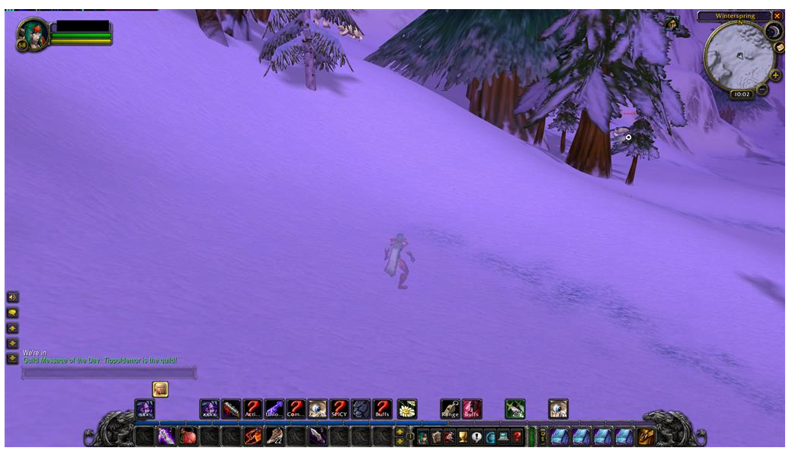

### Player Summary

Show the player state. A hyper link to wowhead appears for the mob you are fighting so you can check out what it drops.

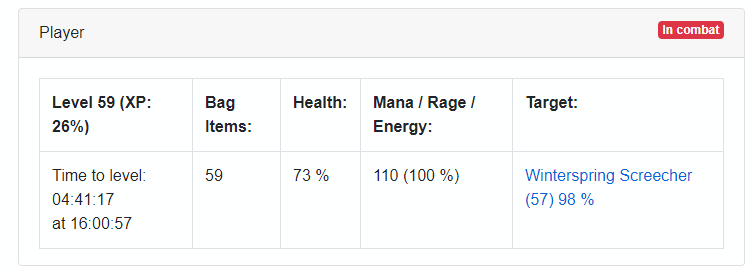

### Route

This component shows:

* The main path
* Your location
* The location of any deaths
* Pathed routes

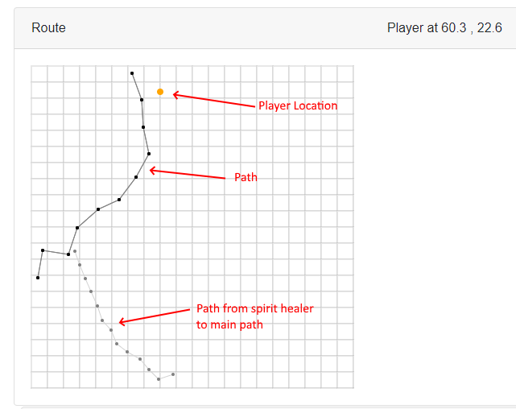

Pathed routes are shown in Green.

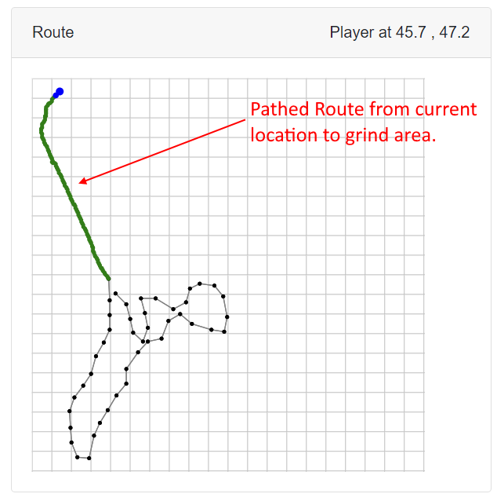


### Leaflet

**Note:** Currently the component **only** works with
* som -> 1.13.x - 1.14.x - 1.15.x
* tbc -> 2.5.x

Also it is required to download the map tiles
* [som - Azeroth and Kalimdor map tiles](https://mega.nz/file/mfgiRRLQ#RvUjd-eb1pMOC5GXCI4jDfpiYyiAUJK_gGfkaWGtz0I)
* * Copy the content under the `json\leaflet\som` folder.
* * So the path look like this `Json\leaflet\som\Azeroth\z2x0y0.png`

* [tbc - Azeroth and Kalimdor and Expansion01 map tiles](https://mega.nz/file/HLAzgJaJ#UxmaVPSLqgbdl_OQ75vd9C1_DV1kTJxzq-Ce727Z8mw)
* * Copy the content under the `json\leaflet\tbc` folder.
* * So the path look like this `Json\leaflet\tbc\Expansion01\z2x0y0.png`

This component is meant to replace the Route later on, it has *'readonly'* mode when no authoring is enabled.

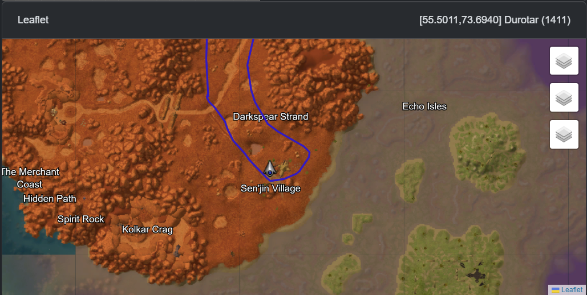

---

While in the sidebar the Leaflet option there's the authoring tool.

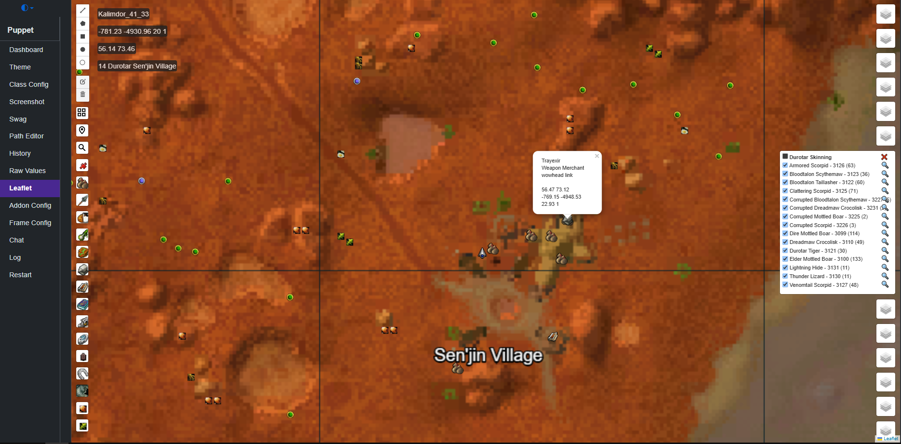

Which allows the draw shapes
* polyline
* rectangle
* circle with custom radius
* single point

TODO: These shapes can be used for the V1 navigation system.

After clicking on any zone, that zone will be the currentArea.

When the current area is Active, at the left side context based filters can be enabled to show certain types of npcs(vendors, skinnable npcs, or nodes)

On the other hand, when pressing the *redcross* button it is possible to record the player movement as a path.

How to record and save a path ?
* Make sure to have a loaded class profile
* Navigate to Leaflet
* Go to the start location
* Press the *redcross* button to start the record
* When the desired route is reached, press the *redcross* button once again.
* You should see a yellow highlight of the path has been added then it will become red.
* **Right click** on the recorded path, to enable edit mode.
* Edit mode is active when you should be able to move the route node points.
* Mouse **middle click** or **scroll button click** on the Route to save it (should see a yellow highlight once again)
* The route will be saved as the `CurrentZoneName_YYYY_MM_DD_HH_MM_SS.json` under the `/json/path` folder. (example: `Durotar_2025_04_21_15_45_21.json`)
* The saved route can be loaded and edited the same way.

---

### Goal

This component contains a button to allow the bot to be enabled and disabled.

This displays the finite state machine. The state is goal which can run and has the highest priority. What determines if the goal can run are its pre-conditions such as having a target or being in combat. The executing goal is allowed to complete before the next goal is determined.

Some goals (combat,pull target) contain a list of spells which can be cast. The combat task evaluates its spells in order with the first available being cast. The goal then gives up control so that a higher priority task can take over (e.g. Healing potion).

The visualisation of the pre-conditions and spell [requirement(s)](#requirement) makes it easier to understand what the bot is doing and determine if the class file needs to be tweaked.

<table>
    <tr>
        <td>
            <a href="./images/float_dark_goals_component.png" target="_blank">
                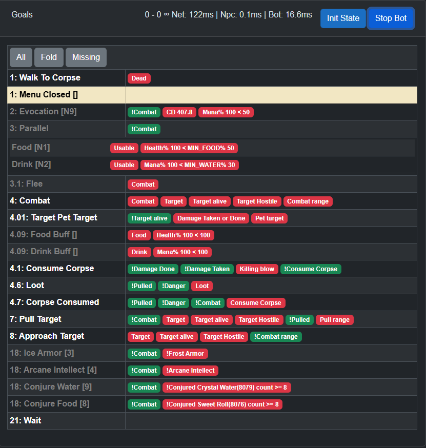
            </a>
        </td>
        <td>
            <a href="./images/float_light_goals_component.png" target="_blank">
                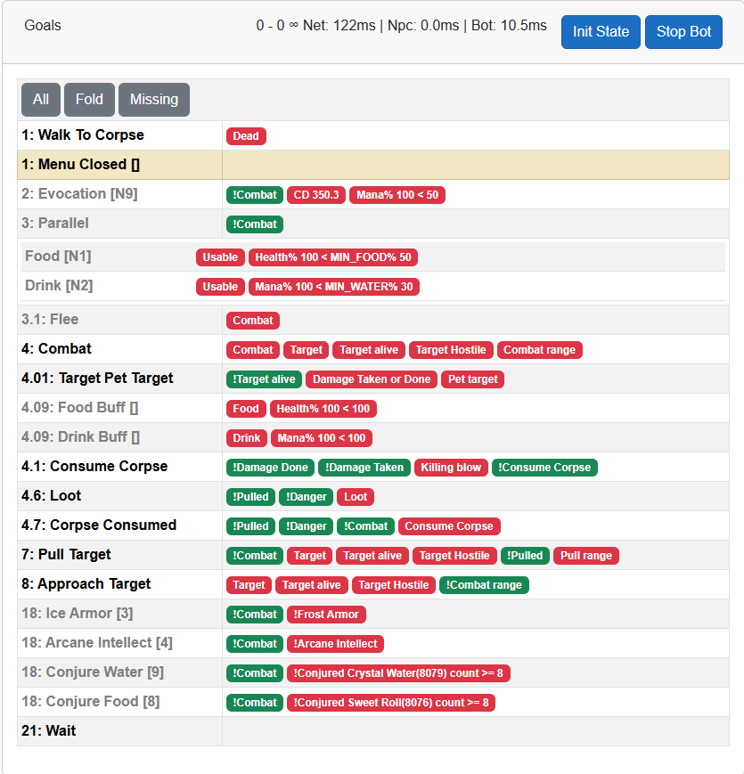
            </a>
        </td>
    </tr>
</table>

# Recording a Path

**Why paths matter**: The bot needs to know WHERE to grind. A path defines the route your character follows - where to walk, which mobs to encounter, and how to reach vendors. Without a path, the bot doesn't know where to go.

**Types of paths**:
| Path Type | Purpose | Location in Config |
| --- | --- | --- |
| Grind path | Main route for killing mobs | `PathFilename` in class file root |
| NPC path | Route to reach vendors/repairers through obstacles | `PathFilename` within NPC task |

The path to run when grinding (PathFilename in root of class files).
```json
"PathFilename": "16_LochModan.json",
"PathThereAndBack": true,
"PathReduceSteps": false,
```

The short path to get to the vendor/repairer when there are obstacles close to them (PathFilename withing NPC task):
```json
{
    "Name": "Sell",
    "Key": "C",
    "Requirement": "BagFull",
    "PathFilename": "Tanaris_GadgetzanKrinkleGoodsteel.json",
    "Cost": 6
}
```

## Recording a new path

To record a new path place your character where the start of the path should be, then click on the 'Record Path' option on the left hand side of the bot's browser window. Then click 'Record New'.

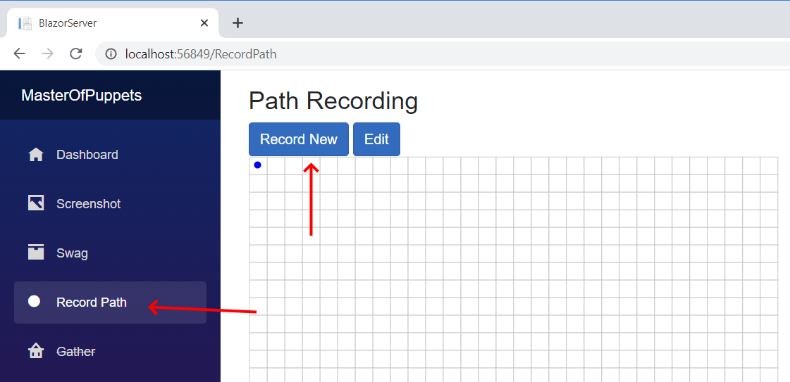

Now walk the path the bot should take.

If you make a mistake you can remove spots by clicking on them on the list on the right. Then either enter new values for the spot or click 'Remove'.

For tricky parts you may want to record spots close together by using the 'Distance between spots' slider (Smaller number equals closer together).

Once the path is complete click 'Save'. This path will be saved with a generic filename e.g. `Path_20201108112650.json`, you will need to go into your `/Json/path` and rename it to something sensible.

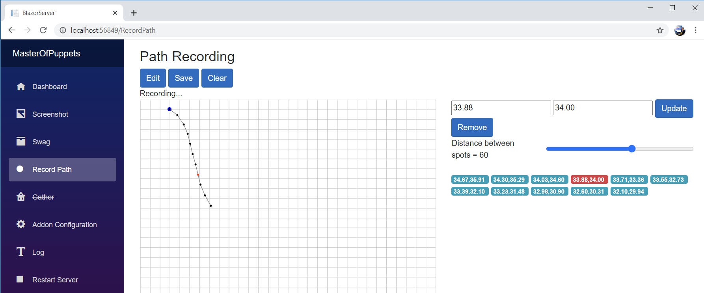

## Types of paths

### There and back 

```json
"PathThereAndBack": true
```

These paths are run from one end to the other and then walked backwards back to the start. So the end does not need to be near the start.

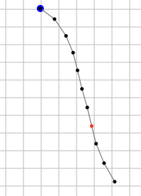

### Joined up

```json
"PathThereAndBack": false
```

These paths are run from one end to the other and then repeated. So the path needs to join up with itself i.e. the end needs to be near the start.

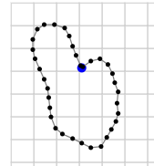

## Tips  

Try to avoid the path getting too close to:

* Obstacles like trees, houses.
* Steep hills or cliffs (falling off one can make the bot get stuck).
* Camps/groups of mobs.
* Elite mob areas, or solo elite paths.

The best places to grind are:

* Places with non casters i.e. beasts. So that they come to you when agro'd.
* Places where mobs are far apart (so you don't get adds).
* Places with few obstacles.
* Flat ground.


# V1 Remote Pathing - PathingAPI

Pathing is built into the bot so you don't need to do anything special except download the MPQ files. You can though run it on its own server to visualise routes as they are created by the bot, or to play with route finding.

The bot will try to calculate a path in the following situations:

* Travelling to a vendor or repair.
* Doing a corpse run.
* Resuming the grind path at startup, after killing a mob, or if the distance to the next stop in the path is not a short distance.

## Video:

[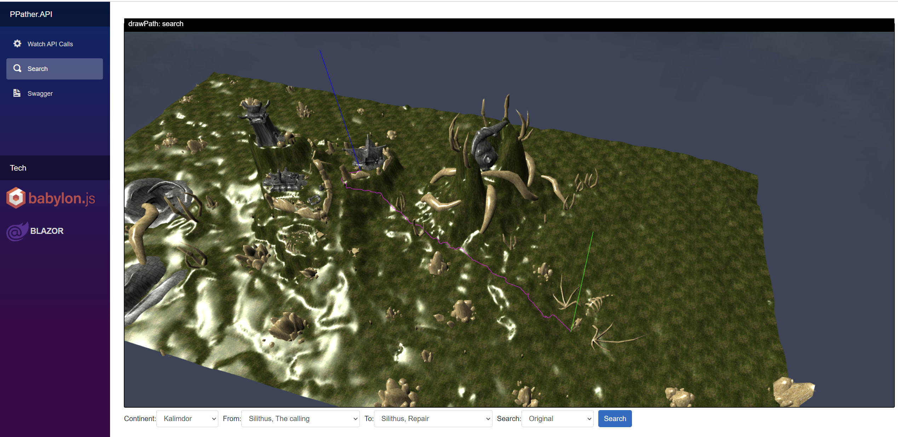](https://www.youtube.com/watch?v=Oz_jFZfxSdc&t=254s&ab_channel=JulianPerrott)

## Running on its own server.

In visual studio just set PathingAPI as the startup project or from the command line:

```ps
cd C:\WowClassicGrindBot\PathingAPI
dotnet run --configuration Release
```

Then in a browser go to http://localhost:5001

There are 3 pages:

* Watch API Calls
* Search
* Route
* Swagger

Requests to the API can be done in a new browser tab like this or via the Swagger tab. You can then view the result in the Watch API calls viewer.

```
http://localhost:5001/api/PPather/MapRoute?map1=1446&x1=51.0&y1=29.3&map2=1446&x2=38.7&y2=20.1
```

Search gives some predefined locations to search from and to.

## Running it along side the bot

In visual studio right click the solution and set Multiple startup projects to BlazorServer and PathingApi and run.

Or from 2 command lines `dotnet run` each.

```ps
cd c:\WowClassicGrindBot\PathingAPI
dotnet run --configuration Release
```

```ps
cd c:\WowClassicGrindBot\BlazorServer
dotnet run --configuration Release
```

## As a library used within the bot

The bot will use the PathingAPI to work out routes, these are shown on the route map as green points.


# Macros

**Why Macros?** WoW macros combine multiple actions into a single button press. The bot can use macros just like regular abilities - they're essential for complex actions like targeting NPCs for vendoring, combining pet commands, or using multiple ranks of the same item.

**Naming Convention**: When using macros in your class profile, use **lowercase** names (e.g., `"heal"`, `"feedpet"`) to distinguish them from actual spells. This helps the `ActionBarPopulator` correctly identify what to place on the action bar.

Warlock `heal` macro used in warlock profiles.
```css
#showtooltip Create Healthstone
/use Minor Healthstone
/use Lesser Healthstone
/use Healthstone
/use Greater Healthstone
/use Major Healthstone
/use Master Healthstone
/stopmacro [combat]
/cast [nocombat] Create Healthstone
```

Hunter `feedpet` macro replace `Roasted Quail` with the proper diet
```css
#showtooltip
/cast Feed Pet
/use Roasted Quail
```

Hunter `sumpet` macro
```css
#showtooltip
/cast [target=pet,dead] Revive Pet
/cast [target=pet,noexists] Call Pet
```

Rogue weapon enchant (use 17 for second weapon):
```css
#showtooltip
/use Instant Poison V 
/use 16
/click StaticPopup1Button1 
```

Melee weapon enchant:
```css
#showtooltip
/use Dense Sharpening Stone
/use 16
/click StaticPopup1Button1
```

# Troubleshooting / FAQ

## Most Common Issue: Game Window Must Be Visible

**The bot reads pixel colors from the top-left corner of the WoW game window.** If anything covers this area, the bot cannot function properly.

**Symptoms:**
- Bot not responding to game state
- "Waiting for client" or similar messages
- Bot actions don't match what's happening in-game
- Screenshot component shows wrong/static image

**Solution:**
- **Keep the WoW window uncovered** - don't let browsers, Discord, or other windows overlap it
- Position the bot's web UI (browser) on a second monitor, or beside the game window
- If using one monitor, make the WoW window smaller and position it so the top-left corner is always visible
- Consider using **Windowed** mode instead of Fullscreen for easier window management
- **Use a fixed stable framerate** - set the game to a consistent FPS cap such as 15, 30, 60, 90, or 120. These values are tested and proven to provide a stable experience

**Technical explanation:** The addon encodes game state (health, mana, target info, etc.) as colored pixels in frames positioned at the top-left of the screen. The application captures these pixels via screenshot and decodes them. Any overlay or window covering these pixels will cause incorrect readings.

---

## Addon Issues

**Q: Addon not showing in WoW addon list**
- Ensure the addon folder is named correctly (should match the Title you configured)
- Check that the addon is in the correct `Interface\AddOns\` folder for your WoW version
- Make sure addon files are not inside an extra subfolder

**Q: "Addon blocked" or keybindings not working**
- You cannot set keybindings while in combat - log out and back in
- Run `/<prefix>actions` to manually create secure buttons (e.g., `/dcactions`)
- Check that you're not running conflicting addons

**Q: Pixel reading errors / wrong colors detected**
- **First check**: Is the WoW window top-left corner visible? See [Most Common Issue](#most-common-issue-game-window-must-be-visible) above
- The addon auto-configures graphics settings, but verify: Anti-Aliasing = None, Render Scale = 100%
- Make sure no screen overlays (Discord, GeForce Experience, Steam overlay) are affecting the game window
- Try running WoW in Windowed mode instead of Fullscreen
- Disable Windows HDR if enabled

## Application Issues

**Q: Application cannot find WoW process**
- Make sure WoW is running and you are logged into a character
- If running multiple WoW clients, use the `-p` parameter to specify the process ID

**Q: Path not found / navigation errors**
- Ensure MPQ files are downloaded and placed in `Json\MPQ\`
- For Cataclysm+, you need V3 Remote pathing (AmeisenNavigation)

**Q: Class profile won't load**
- Check JSON syntax - use a JSON validator
- Ensure all required fields are present (see [Class Configuration](#class-configuration))
- Check the log output for specific error messages

## Keybinding Issues

**Q: Keys not being pressed / wrong keys pressed**
- Check the Frontend "Key Bindings" page to verify detected bindings
- Use the key tester on the Key Bindings page to verify input is working
- For non-US keyboard layouts, avoid Main Action Bar slots 11-12 (see [Known Limitation](#known-limitation-main-action-bar-slots-11-and-12))

**Q: Modifier keys (Shift/Ctrl/Alt) not working**
- Only single modifiers are supported, not combinations like Shift-Alt
- Verify the binding in WoW uses the same modifier

# Important: Migration Guide for Existing Users

If you are upgrading from a previous version, please read this section carefully.

## Breaking Changes

### Keybinding System Overhaul

The application now **automatically reads your in-game keybindings** instead of requiring manual configuration. This is a significant improvement but requires some migration steps.

**What Changed:**
1. The addon now sends your actual WoW keybindings to the application
2. Modifier keys (Shift, Ctrl, Alt) are now fully supported
3. BindPad addon is bundled and used internally for secure macro buttons
4. Custom actions (StopAttack, ClearTarget) now use Alt-modified keys by default

**Migration Steps:**

1. **Update the Addon**: Copy the new `DataToColor` addon to your WoW Addons folder, replacing the old version.

2. **Install BindPad**: Copy the `BindPad` addon from the `Addons/BindPad/` folder to your WoW Addons folder. This is required for TBC Classic 2.5.5+ compatibility.

3. **First Login**: On first login after the update, the addon will:
   - Automatically set up essential keybindings if they are missing
   - Create secure action buttons for StopAttack, ClearTarget, etc.
   - Read and send all your keybindings to the application

4. **Check Your Class Profile**: The default keys for some BaseActions have changed:
   | Action | Old Default | New Default |
   | --- | --- | --- |
   | Interact | `I` | `Alt-Home` |
   | InteractMouseOver | `J` | `Alt-End` |
   | ClearTarget | `Insert` | `Alt-Insert` |
   | StopAttack | `Delete` | `Alt-Delete` |
   | TargetFocus | `PageUp` | `Alt-PageUp` |
   | FollowTarget | `PageDown` | `Alt-PageDown` |

   If your class profile overrides these keys, you may need to update them.

5. **In-Game Verification**: After logging in, you can verify the bindings are working:
   - Press `Shift-PageUp` to toggle addon config mode (should see "Config mode" / "Normal mode" messages)
   - Press `Shift-PageDown` to flush addon state (should see "Flush State" message)

### Troubleshooting

If bindings are not working after migration:
1. Make sure you are not in combat when logging in (bindings cannot be set in combat)
2. Run `/<prefix>actions` to manually create and bind the custom actions (e.g., `/dcactions`)
3. Run `/<prefix>bindings` to set up default action bar bindings (e.g., `/dcbindings`)
4. Check the Frontend "Key Bindings" page to see what bindings the addon detected

**Note**: The command prefix (e.g., `dc`) is derived from your addon title. If you named your addon "daq" during setup, use `/daqactions`, `/daqbindings`, etc.
